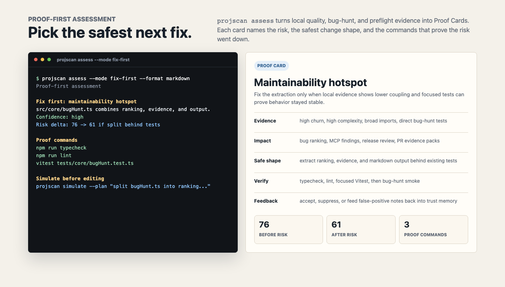
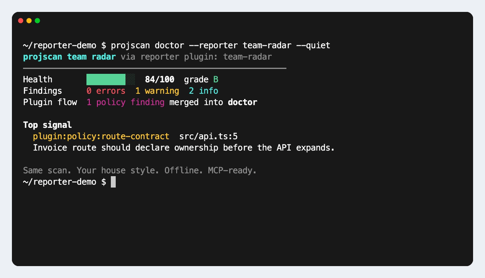

<div align="center">

# projscan

[](https://www.npmjs.com/package/projscan)
[](https://github.com/abhiyoheswaran1/projscan/blob/main/LICENSE)
[](https://nodejs.org)
[](#install)

**Local proof for AI-assisted engineering.** projscan gives agents and engineers the repo context, risk checks, proof commands, and review gates they need before editing, handing off, or preparing a release candidate.

[Install](#install) · [Daily workflows](#daily-workflows) · [MCP Setup](#mcp-setup) · [Commands](#command-map) · [Trust](#trust-model) · [Full Guide](docs/GUIDE.md)


</div>

---

## Use It For

Use projscan when an agent asks one of these questions:

- Which files should I read before changing this feature?
- Which proof commands should I run before handoff?
- Which risks need fixes, reviewer attention, or release sign-off?
- Which risk should I fix first?

projscan runs core scans on your machine. It respects `.gitignore`, keeps `.env` values out of scans unless you opt in, and exposes the same evidence through a CLI and a 48-tool MCP server. The language layer uses 11 AST adapters covering 12 named languages.

```text
Your agent / engineer
  (Codex, Claude Code, Cursor, CI, your scripts)
       |   intent, diff, repo files, feedback, proof requests
       v
  +----------------------------------------------------------------+
  |  projscan   (runs locally, source stays on this machine)       |
  |  ------------------------------------------------------------  |
  |  Mission Control -> assess Cards -> simulate risk -> prove      |
  |                         |              |              |         |
  |                         |              |              +- allowed files
  |                         |              |              +- forbidden files
  |                         |              |              +- proof receipt
  |                         |              +- bounded extraction       |
  |                         |              +- regression test first    |
  |                         |              +- leave unchanged          |
  |                         +- evidence strength                   |
  |                         +- trust memory                        |
  |                         +- AgentLoopKit handoff                |
  |                                                                |
  |  CLI + MCP tools, no account, telemetry off by default         |
  +----------------------------------------------------------------+
       |   next safe action, exact proof commands, handoff packet
       v
Reviewer / CI / LLM provider
  (only the evidence you choose to pass along)
```

## Install

```bash
npm install -g projscan
projscan start
```

Run without a global install:

```bash
npx projscan start
```

Check the trust boundary first:

```bash
projscan privacy-check
projscan start --intent "what can projscan read?"
projscan start --intent "does projscan read .env values?"
```

## Daily workflows

Use these four workflows before scanning the full command catalog.

### Before editing a feature

```bash
projscan start --intent "what files do I need to change for auth?"
projscan start --intent "what should we build next?" # Routes to a before-edit implementation workplan
projscan start --intent "is my agent allowed to change billing retry logic?"
projscan understand --view change --intent "add auth token refresh" --format json
projscan prove --intent "is my agent allowed to change billing retry logic?"
projscan preflight --mode before_edit --format json
```

You get a cited change map, read-first files, likely touched files, blocked inputs, an executable Proof Contract, and a before-edit proof gate. Agent-permission intents route to `projscan prove`, so `start` can hand the next agent a contract path instead of a broad checklist.

Success criteria: the agent can name the files to read first, the likely files to touch, the forbidden files to avoid, and the proof commands to run before editing.

### Verified change workflow

```bash
projscan start --intent "is my agent allowed to change billing retry logic?"
projscan prove --intent "is my agent allowed to change billing retry logic?" --save-contract .projscan/proof-contract.json
# Make the bounded edit, then run the proof command.
projscan prove --run -- npm test -- tests/billing/retry.test.ts
projscan prove --changed --contract .projscan/proof-contract.json --format markdown
```

The command path is `start -> prove -> run -> changed`. Make the bounded edit after the contract exists and before `prove --run`. `start` chooses the contract workflow. `prove --intent` writes `.projscan/proof-contract.json` only when `--save-contract` is present. `prove --run -- <command...>` executes a local proof command, records the exit code, captures a redacted log, and fingerprints the current changed files. `prove --record-command` remains available for imported CI or external evidence when projscan did not run the command. `prove --changed` checks the current working tree against the contract and local ledger.

You get a Proof Contract before edits and a Proof Receipt after edits. The contract names allowed files, forbidden files, risky contracts, likely tests, missing regression-test evidence, proof commands, safe change shape, rollback, confidence, reviewer guidance, and `proofRequirements` for each risk surface. The receipt checks the real working tree against that contract and classifies changed files as allowed production, expected tests, documentation, generated proof artifacts, config/security drift, forbidden touches, or unexpected production. The receipt reports proof replay status, Proof Sufficiency, risk delta, commit readiness, and a reviewer checklist.

Proof Replay records command, exit code, duration, changed-file fingerprint, redacted summary, log path, and source in `.projscan/proof-ledger.jsonl`. Executed proof logs stay under `.projscan/proof-logs/`. `prove --changed` marks proof as passed, missing, failed, partial, or stale. The receipt JSON includes `proofReplay` with a replay timeline, `changedAfterProof`, replay command, and local receipt fingerprint. If the agent edits new files after proof ran, the receipt says the proof is stale before a reviewer reads the diff.

Proof Sufficiency estimates whether the local ledger covers each changed surface. `proofSufficiency` marks rows as strong, adequate, weak, missing, stale, or failed, then lists the exact gaps reviewers need to resolve.

Team Proof Recipes let a repo encode required proof for sensitive paths in `proofRecipes`; when a matching recipe is configured, `prove --intent` adds that recipe's commands, reviewers, and forbidden files to the Proof Contract. `prove --changed` and `projscan evidence-pack --pr-comment` then show missing recipe proof, required reviewers, and recipe drift in the Proof Receipt. The recipe does not run proof commands by itself; use `prove --run -- <command...>` or `prove --record-command` to add evidence to the local ledger.
Saved contracts are the source of truth for `prove --changed`; update the contract when a team recipe changes.

Every `prove` report includes `verifiedWorkflow`, a compact JSON summary for agents and MCP clients. It names the phase, next action, next command, scope status, proof status, proof sufficiency status, risk delta direction, reviewer decision, and stale/missing/failed proof flags.

Success criteria: the reviewer sees scope, proof execution, proof freshness, and sufficiency for the changed risk surface.

### Before handoff or commit

```bash
projscan start --intent "is this safe to commit?"
projscan assess --mode fix-first --format markdown
projscan preflight --mode before_commit --format json
projscan evidence-pack --pr-comment
```

You get changed-file risk, one or two ranked next actions, manual review gates, owner routing, baseline trend memory, and exact proof commands for the reviewer. Use `projscan bug-hunt --format json` when you want the raw fix queue behind the assessment.

Success criteria: the reviewer sees the top fix, the remaining proof, and any manual sign-off gate without reading the full scan output.

### Before release-candidate review

```bash
projscan release-train --format json
projscan preflight --mode before_merge --format json
projscan evidence-pack --pr-comment
```

You get read-only readiness evidence. projscan reports fixes and sign-off gates; it does not tag, publish, deploy, or bump versions from these commands.

Success criteria: release review separates concrete defects from human approval gates before anyone tags or publishes.

### Weekly proof-first assessment

```bash
projscan assess --goal "make this repo safer to ship this week"
projscan assess --mode fix-first --format markdown
projscan simulate --plan "split bugHunt.ts into ranking, evidence, and output modules"
```

You get Proof Cards: each recommendation carries local evidence, impact, a safe change shape, verification commands, feedback or suppression guidance, and a risk delta. Add `--baseline previous-assess.json` to compare the current risk delta against a prior run. `assess` composes existing quality, bug-hunt, and preflight evidence; it does not release, tag, publish, or deploy.

Proof Cards also show evidence strength, confidence reason, ranking reasons, trust memory, evidence gaps, and an AgentLoopKit handoff packet. Add `--feedback .projscan-feedback.json` when accepted recommendations, noisy findings, false positives, or suppressions should affect future ranking.

Use the risk delta simulator before a refactor or extraction. It predicts likely touched files, affected tests, contract surfaces, rollout steps, proof commands, and before/after risk from local evidence. It compares bounded extraction, test-first, and leave-unchanged alternatives, then names the recommended option. It is read-only: it does not edit files, run the plan, release, tag, publish, or deploy.



Success criteria: the team sees the one or two highest-value fixes, why they matter, how to prove them, and whether ship-readiness still needs caution or review.

## Mission Control

`projscan start --intent "<goal>"` turns a plain-language goal into an execution plan:

- current command
- blocked inputs
- follow-up commands
- proof queue
- done criteria
- review gate

Save a mission when work may pass between agents:

```bash
projscan start --save-mission .projscan/mission --intent "is it safe to commit this change?"
projscan mission-proof --mission .projscan/mission --format markdown
projscan start --mission .projscan/mission
```


Mission bundles include a runbook, task card, handoff prompt, proof scripts, review gate JSON, reviewer replies, and proof logs. `mission-proof` summarizes passed proof, failed gates, reruns, reviewer decisions, and optional manual baseline data.

<details>
<summary><strong>Terminal demos</strong></summary>


</details>

Regenerate README media:

```bash
npm run docs:screenshots
npm run docs:demos
```

## 4.15.0 Notes

4.15.0 strengthens the proof-first change loop:

- `projscan prove --intent "<change>"` creates a local Proof Contract before
  editing. It names allowed files, forbidden files, risky contracts, likely
  tests, missing regression-test evidence, proof commands, rollback, confidence,
  Trust Memory signals, evidence gaps, reviewer guidance, and
  `proofRequirements` for each risk surface.
- `projscan start --intent "is my agent allowed to change billing retry logic?"`
  routes directly to `projscan prove`, so agent-permission prompts start with a
  bounded contract instead of a broad checklist.
- `projscan prove --run -- <command...>` executes an explicit local proof
  command with shell execution disabled, writes a redacted log under
  `.projscan/proof-logs/`, appends a `prove-run` ledger row, and lets
  `prove --changed` replay executed proof instead of self-reported evidence.
- `projscan prove --changed` validates the current working tree against a saved
  contract and emits a Proof Receipt for PRs, agents, and CI. Its changed-file
  classes separate allowed production edits, expected tests, documentation,
  generated proof artifacts, config/security drift, forbidden touches, and
  unexpected production changes before giving a copyable reviewer decision.
  The receipt also includes `proofReplay` with replay status, timeline events,
  `changedAfterProof`, replay command, and receipt fingerprint. Proof
  Sufficiency shows whether each `proofRequirements` row has strong, adequate,
  weak, missing, stale, or failed proof.
- Team Proof Recipes let a repo add path-matched `proofRecipes` to
  `.projscanrc.json`. Matching recipes add required commands, reviewers, and
  forbidden drift to the Proof Contract and Proof Receipt.
- `projscan prove --record-command "<command>" --exit-code <code>` appends a
  local Proof Ledger row with command, duration, changed-file fingerprint,
  redacted output summary, and optional log path when importing proof from CI or
  another runner.
- Every `prove` JSON report includes `verifiedWorkflow`, so agents can read the
  next action, next command, scope status, proof status, `proofSufficiency`
  status, reviewer decision, and stale/missing/failed proof flags without
  parsing Markdown.
- Saved Mission Control bundles append Proof Ledger rows while `mission.sh`
  runs the existing proof queue. The script still writes proof logs and status
  JSONL for humans.
- `projscan evidence-pack --pr-comment` includes the latest Proof Receipt
  summary when a contract and ledger are available, so PR comments show proof
  status, proof replay, reviewer decision, scope, stale proof, failed proof,
  proof sufficiency, recipe gaps, required reviewers, changed-after-proof files,
  receipt fingerprint, and the replay command.
- Proof artifacts are harder to spoof: Proof Contract and Proof Ledger reads
  reject symlink escapes, proof logs redact more standalone token/key shapes,
  and generated mission scripts reject shell control syntax before running.
- The codebase behind the proof workflow is smaller and easier to review:
  source hotspots in Mission Control, bug-hunt, quality-scorecard, workplan,
  adoption, start-mode routing, and intent routing were split into focused
  helpers with architecture tests.
- MCP now includes `projscan_prove`, bringing the MCP surface to 48 tools.

## 4.14.0 Notes

4.14.0 ships the Verified Change Workflow and Executed Proof Runner:

- `projscan prove --intent "<change>"` creates a local Proof Contract before
  editing.
- `projscan prove --run -- <command...>` executes an explicit local proof
  command with shell execution disabled and writes a redacted Proof Ledger row.
- `projscan prove --changed` emits a Proof Receipt for PRs, agents, and CI.
- `projscan evidence-pack --pr-comment` includes the latest Proof Receipt
  summary when a contract and ledger are available.
- MCP includes `projscan_prove`, bringing the MCP surface to 48 tools.

## 4.12.1 Notes

4.12.1 is the simulator precision patch for the Proof Cards V2 release:

- `projscan simulate --plan` no longer treats one-letter filenames such as
  `s.ts` as matches for broad plan text.
- Simulator term-overlap evidence now filters generated agent/cache paths and
  weak planning terms, so logs or proof artifacts do not become likely files
  when the plan names no concrete repo target.

## 4.12.0 Notes

4.12.0 is the Proof Cards V2 daily trust loop release:

- Proof Cards now show evidence strength, confidence reason, evidence gaps,
  ranking reasons, Trust Memory context, and AgentLoopKit handoff packets.
- `projscan assess --feedback <path>` applies local reviewer feedback to
  ranking and confidence.
- `projscan start --intent "is this safe to commit?"` now starts with
  `projscan assess --mode fix-first` and keeps preflight as proof.
- `projscan simulate --plan "<change plan>"` compares bounded extraction,
  regression test first, and leave unchanged alternatives before recommending
  the safest option.

## 4.11.1 Notes

4.11.1 is a public README media refresh for the proof-first release:

- Added a dedicated Proof Cards screenshot for `projscan assess` and
  `projscan simulate`.
- Regenerated README screenshots so public media showed the 47-tool MCP
  surface.
- Updated website handoff guidance to use immutable `v4.11.1` media URLs.

## 4.11.0 Notes

4.11.0 is the proof-first engineering command center release:

- `projscan assess` turns quality, bug-hunt, and preflight evidence into Proof Cards with fix-first guidance and risk delta.
- `projscan simulate --plan "<change plan>"` predicts likely files, tests, contracts, rollout, proof commands, and before/after risk before editing.
- MCP now exposes 47 tools, including `projscan_assess` and `projscan_simulate`.

## MCP Setup

Use MCP when an agent should call projscan during a coding session.

Claude Code:

```bash
claude mcp add projscan -- npx -y projscan mcp
```

Codex CLI:

```toml
[mcp_servers.projscan]
command = "npx"
args = ["-y", "projscan", "mcp"]
```

Cursor, Windsurf, Cline, Continue, Zed, and other MCP clients can launch the same command:

```bash
npx -y projscan mcp
```

Add `--watch` if the client supports `notifications/file_changed`:

```bash
npx -y projscan mcp --watch
```

### Agent Questions

| Agent question                               | CLI or MCP route                                                                         |
| -------------------------------------------- | ---------------------------------------------------------------------------------------- |
| Which files implement auth?                  | `projscan search "auth" --format json`                                                   |
| Who imports this file?                       | `projscan semantic-graph --query importers --file src/auth/jwt.ts --format json`         |
| What breaks if I rename this symbol?         | `projscan impact --symbol buildCodeGraph --format json`                                  |
| What should I fix first?                     | `projscan bug-hunt --format json`                                                        |
| What is risky and worth fixing this week?    | `projscan assess --goal "make this repo safer to ship this week"`                        |
| Is this refactor worth doing?                | `projscan simulate --plan "split bugHunt.ts into ranking, evidence, and output modules"` |
| Is my agent allowed to make this change?     | `projscan start --intent "is my agent allowed to change billing retry logic?"`           |
| Did the change stay inside scope?            | `projscan prove --changed --contract .projscan/proof-contract.json --format markdown`    |
| Which files have high risk and low coverage? | `projscan coverage --format json`                                                        |
| What should my agent do next?                | `projscan workplan --format json`                                                        |
| Which proof belongs in this PR?              | `projscan evidence-pack --pr-comment`                                                    |
| Is this branch ready to merge?               | `projscan preflight --mode before_merge --format json`                                   |

## Command Map

| Command                   | Use it when you need                                                        |
| ------------------------- | --------------------------------------------------------------------------- |
| `projscan start`          | first-60-seconds orientation, routing, and Mission Control                  |
| `projscan understand`     | cited repo map, runtime flows, public contracts, and change readiness       |
| `projscan preflight`      | proceed, caution, or block gate for edit, commit, or merge                  |
| `projscan assess`         | proof-first assessment with Proof Cards, risk delta, and fix-first guidance |
| `projscan simulate`       | risk delta simulator for a proposed change plan before editing              |
| `projscan prove`          | executable Proof Contracts, Verified Workflow JSON, and Proof Receipts      |
| `projscan evidence-pack`  | review evidence with risks, owners, proof receipts, and next commands       |
| `projscan bug-hunt`       | ranked fix queue from health, hotspots, session, and preflight evidence     |
| `projscan workplan`       | ordered agent tasks with proof and handoff text                             |
| `projscan doctor`         | project health, tooling gaps, dead code, and supply-chain signals           |
| `projscan review`         | one-call PR review from structural diff, risk, cycles, functions, and deps  |
| `projscan impact`         | blast radius for a file or symbol before rename, delete, or upgrade         |
| `projscan semantic-graph` | imports, exports, importers, symbol definitions, and package importers      |
| `projscan dataflow`       | framework-aware source-to-sink risks                                        |
| `projscan hotspots`       | churn, complexity, ownership, and coverage risk ranking                     |
| `projscan coverage`       | high-risk files with weak test coverage                                     |
| `projscan dependencies`   | dependency inventory, license summary, and risk notes                       |
| `projscan upgrade <pkg>`  | offline upgrade impact from changelog and importer evidence                 |
| `projscan audit`          | normalized `npm audit` findings and SARIF                                   |
| `projscan coordinate`     | collisions, claims, and merge-risk across worktrees                         |
| `projscan plugin`         | local analyzer and reporter plugin workflow                                 |
| `projscan privacy-check`  | local scan boundary, telemetry, ignore rules, and network-capable paths     |
| `projscan mcp`            | MCP server over stdio                                                       |

Run the generated command help when you need flags:

```bash
projscan help
projscan <command> --help
```

## Output Formats

Commands support `console`, `json`, `markdown`, `sarif`, and `html` where those formats fit the command.

```bash
projscan analyze --format json
projscan doctor --format markdown
projscan ci --format sarif > projscan.sarif
projscan evidence-pack --pr-comment
projscan mission-proof --write reports/mission-proof.md
```

Use scoped and redacted reports when evidence leaves the repo:

```bash
projscan analyze --report-scope src/api --redact-paths --format json
projscan analyze --report-scope "src/api,packages/backend" --redact-paths --format json
projscan doctor --report-policy apiEvidence --format markdown
```

## Configuration

Create a `.projscanrc.json` when repo defaults should live in source control:

```json
{
  "minScore": 80,
  "failOn": "warning",
  "baseRef": "origin/main",
  "ignore": ["**/fixtures/**", "**/generated/**"],
  "scan": {
    "includeIgnored": false,
    "scanEnvValues": false,
    "offline": false
  },
  "disableRules": ["large-*"],
  "suppress": {
    "hardcoded-secret": ["src/firebase.ts"]
  },
  "severityOverrides": {
    "missing-prettier": "info"
  },
  "proofRecipes": [
    {
      "id": "billing-critical",
      "matches": ["src/billing/**"],
      "requiredCommands": ["npm test -- tests/billing/retry.test.ts"],
      "requiredReviewers": ["@platform"],
      "forbiddenFiles": ["src/auth/**"]
    }
  ],
  "reportPolicies": {
    "apiEvidence": {
      "reportScope": ["src/api", "packages/backend"],
      "redactPaths": true
    }
  }
}
```

Use `suppress` for a known false positive in a specific path without disabling
the rule everywhere. For one line, add an inline directive next to the value:

```ts
const firebaseKey = 'AIza...'; // projscan-ignore-line hardcoded-secret -- Firebase web keys are public identifiers
```

Use `proofRecipes` when a path needs team-specific proof; when a matching recipe
is configured, `projscan prove` adds its proof commands, reviewers, and forbidden
files to the contract and receipt. It does not run proof commands by itself.
Recipes without `requiredCommands` are skipped, and duplicate recipe IDs keep the
first valid recipe.

Config docs live in [docs/GUIDE.md](docs/GUIDE.md#configuration-projscanrc).

## CI

Use `projscan ci` to gate pull requests:

```bash
projscan ci --min-score 80
projscan ci --changed-only
projscan ci --format json
projscan ci --format sarif > projscan.sarif
```

`ci --format json` keeps `ci.issues[]` annotation-ready: each issue includes
`ruleId`, `severity`, `message`, `location`, `locations`, and `remediation`
when projscan has that data.
`doctor --format json` and `ci --format json` also include `scoreBreakdown`,
which shows the base score, severity weights, category penalties, total penalty,
final score, and grade.
By default, `ci` only fails a below-threshold score when there is a warning or
error. Set `"failOn": "info"` for legacy strictness or `"failOn": "error"` for
error-only blocking.

GitHub Actions example:

```yaml
name: ProjScan
on:
  pull_request:
    branches: [main]

permissions:
  contents: read
  security-events: write

jobs:
  scan:
    runs-on: ubuntu-latest
    steps:
      - uses: actions/checkout@v4
        with: { fetch-depth: 0 }
      - uses: actions/setup-node@v4
        with: { node-version: 24 }
      - uses: abhiyoheswaran1/projscan@v1
        with:
          min-score: '80'
          changed-only: 'true'
```

## Plugins

Local plugins let teams add project-specific analyzer rules and custom human reports without changing projscan core.

### Load local plugins

```bash
projscan plugin list
projscan plugin validate .projscan-plugins/team-radar.projscan-plugin.json
projscan plugin test .projscan-plugins/team-radar.projscan-plugin.json
PROJSCAN_PLUGINS_PREVIEW=1 projscan doctor --reporter team-radar
```

Run `projscan help` for the generated command-by-command support matrix.



Plugin docs:

- [Plugin Authoring](docs/PLUGIN-AUTHORING.md)
- [Plugin Gallery](docs/PLUGIN-GALLERY.md)
- [2.0 Migration Guide](docs/2.0-MIGRATION.md)
- [Manifest Schema](docs/plugin.schema.json)

## Supported Repos

projscan reads TypeScript, JavaScript, Python, Go, Java, Ruby, Rust, PHP, C#, Kotlin, Swift, and C++ with AST-aware adapters where available. It also detects file-level signals for C, Shell, CSS, HTML, SQL, Dart, Lua, Scala, R, and related project files.

Framework signals cover React, Next.js, Vue, Nuxt, Svelte, Angular, Express, Fastify, NestJS, Vite, Tailwind CSS, Prisma, Remix, SvelteKit, Astro, Hono, Koa, and common monorepo layouts.

JavaScript and TypeScript use `@babel/parser`. Non-JS languages use packaged tree-sitter WASM grammars. The published package has 7 direct runtime dependencies; optional semantic search uses the peer dependency `@xenova/transformers`.

## Trust Model

| Area         | projscan behavior                                                                                                                              |
| ------------ | ---------------------------------------------------------------------------------------------------------------------------------------------- |
| Source code  | Core scans read local files and keep results on your machine.                                                                                  |
| `.gitignore` | Ignored files stay out of scans unless you pass `--include-ignored`.                                                                           |
| `.env`       | projscan reports paths by default. It reads values after `--scan-env-values`.                                                                  |
| Network      | `audit`, registry checks, opt-in telemetry, and optional semantic model download can contact the network.                                      |
| Telemetry    | Off until you run `projscan telemetry enable` or accept the `init team` prompt.                                                                |
| Plugins      | Local plugin code runs after `PROJSCAN_PLUGINS_PREVIEW=1` and an execution path such as `doctor`, `ci`, `analyze`, or `plugin test --execute`. |
| Repo writes  | Source writes require explicit fix commands. Caches, saved missions, Proof Contracts, Proof Ledger rows, and proof logs stay under `.projscan*` local directories. |

Audit helpers:

```bash
projscan privacy-check
projscan telemetry status
projscan telemetry explain
projscan doctor --offline
```

Supply-chain scanners may flag package strings or APIs used by `git`, `npm audit`, `web-tree-sitter`, optional plugins, and optional semantic search. The runtime paths above describe when those capabilities run.

## Install Notes

`projscan@4.15.0` has seven direct runtime dependencies:

- `@babel/parser`
- `@babel/types`
- `chalk`
- `commander`
- `fast-glob`
- `ora`
- `web-tree-sitter`

If npm prints `allow-scripts` warnings during a global install, check which package names it lists. projscan core does not need `node-gyp` grammar builds at runtime in 4.15.0. Open an issue with the warning text if npm reports install scripts from `projscan@latest`, or run `projscan feedback intake --text "<warning text>" --format json` to turn it into a focused setup-trust task.

The grammar packages are build-time sources, not global-install dependencies. Published grammar assets include `tree-sitter-python.wasm` and `tree-sitter-c_sharp.wasm`.

## Deeper Docs

- [Full guide](docs/GUIDE.md)
- [First 10 minutes](docs/FIRST-10-MINUTES.md)
- [Roadmap](docs/ROADMAP.md)
- [Adoption workflows](docs/examples/adoption-workflows.md)
- [Swarm coordination](docs/examples/swarm-coordination.md)
- [Stability policy](docs/STABILITY.md)
- [Telemetry policy](TELEMETRY.md)
- [Security policy](SECURITY.md)

## Contributing

Read [CONTRIBUTING.md](CONTRIBUTING.md) before opening a PR. Contributions use the MIT License and the DCO 1.1 certification described there.

## Legal

- License: [MIT](LICENSE)
- Disclaimer: [DISCLAIMER.md](DISCLAIMER.md)
- Security policy: [SECURITY.md](SECURITY.md)
- Privacy notice: [PRIVACY.md](PRIVACY.md)
- Telemetry policy: [TELEMETRY.md](TELEMETRY.md)
- Trademark and brand policy: [TRADEMARKS.md](TRADEMARKS.md)
- Third-party notices: [THIRD-PARTY-NOTICES.md](THIRD-PARTY-NOTICES.md)

<p align="center">
  <a href="https://www.baseframelabs.com" target="_blank" rel="noopener" title="Part of Baseframe Labs">
    <span>part of</span>
    
  </a>
</p>
