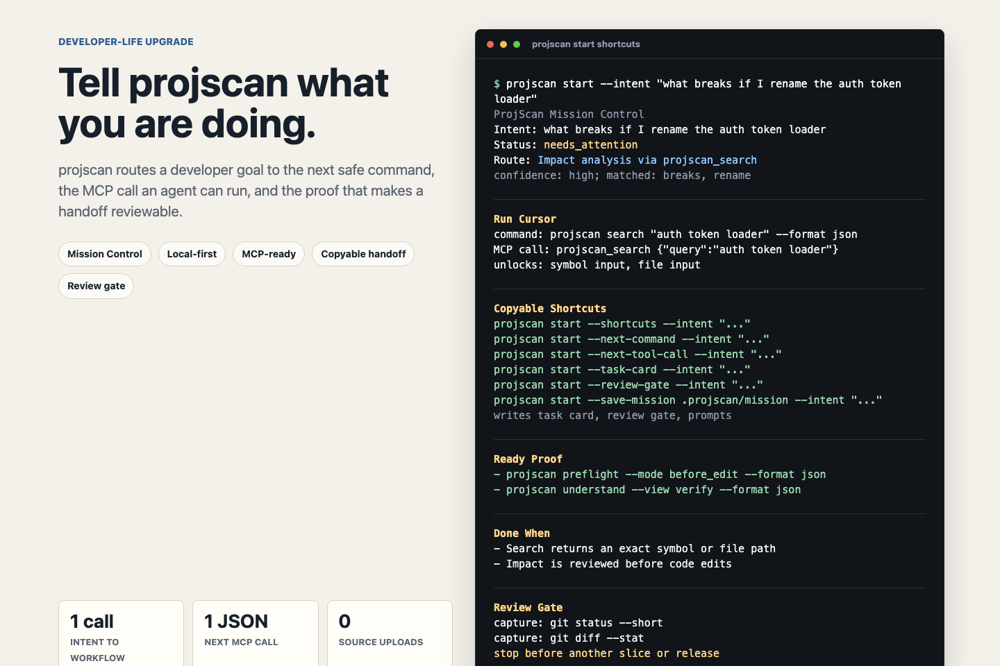
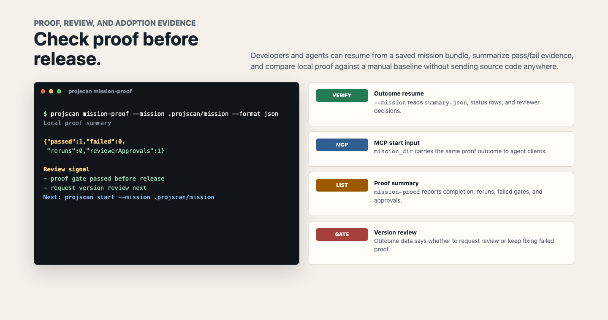

<div align="center">

# projscan

[](https://www.npmjs.com/package/projscan)
[](https://github.com/abhiyoheswaran1/projscan/blob/main/LICENSE)
[](https://nodejs.org)
[](#quick-start)

**Agent-first code intelligence.** An MCP server that lets AI coding agents (Claude Code, Codex, Cursor, Gemini, Windsurf, Cline, Continue, Zed — any MCP-aware client) query your codebase — with a CLI for humans and a local plugin layer for team-specific policy and reporting.

[AI Agent Quick Start](#ai-agent-integration-mcp) · [CLI Quick Start](#quick-start) · [Commands](#commands) · [Full Guide](docs/GUIDE.md) · [Roadmap](docs/ROADMAP.md)



</div>

---

## Why?

AI coding agents are becoming the primary interface to code. When you ask an agent *"which files implement auth?"* or *"what breaks if I bump React from 18 to 19?"*, it needs structured repo context, not raw grep output.

**projscan is code intelligence built for agents.** MCP clients get a fast, AST-backed, context-budget-aware view of your codebase: cited repo understanding, semantic graph, dataflow risks, review verdicts, hotspots, ownership, preflight gates, fix prompts, impact analysis, and durable session context. Everything is local and offline.

For teams, projscan turns that context into a repeatable PR habit. `projscan init team` creates policy, CI, ownership, and baseline memory. `projscan evidence-pack --pr-comment` gives reviewers a compact verdict with top risks, First Fix, owner routing, baseline trend memory, and exact next commands. `projscan feedback`, `projscan dogfood`, and `projscan trial` measure whether the loop actually saved time, prevented risky edits, and stayed trustworthy across real repos.

The local plugin platform lets teams add project-specific findings and render `doctor`, `analyze`, and `ci` in their own voice without changing the scan pipeline. Humans get the same information through the CLI.

**Everything is local-first. No source upload. No API keys. `.gitignore` is respected by default. `.env` values are path-only unless explicitly enabled. Anonymous product telemetry is off by default and only runs after explicit opt-in.**

```bash
npx projscan
```


## What's New in 4.1.0

4.1.0 turns projscan into a stronger developer Mission Control layer: tell it the work you are trying to do, and it routes you to the right local proof.

- **Mission Control for real developer goals.** `projscan start --intent "<goal>"` now maps plain-language work to inferred mode, route confidence, ready actions, alternatives, done criteria, proof commands, and a compact handoff prompt.
- **Much broader intent coverage.** Privacy, repo orientation, local setup, change planning, public contracts, file impact, package importers, ownership, PR evidence, release readiness, coordination, and session handoff questions now route to specific commands instead of generic next steps.
- **Proof-first verification.** "Which tests should I run?" and "what proves this works?" route to targeted verification proof, while failing/flaky/build questions still route to focused regression planning.
- **Richer repo and dependency intelligence.** Setup discovery now finds npm scripts, lint/typecheck, e2e, Storybook, Docker Compose, migrations, seed/reset commands, license summaries, package sizes, copyleft risk, and package importer lookups.
- **More reliable agent plumbing.** Project Memory recording and MCP close handling now await their async writes/teardown so session context is less likely to race with agent shutdown.



Regenerate the README screenshots with Playwright:

```bash
npm run docs:screenshots
```

## Unreleased: Mission Execution Plan + Copyable Handoffs

`projscan start --intent "<goal>"` gives agents an execution plan with ordered phases, ready commands, blocked inputs, follow-ups, proof, and done criteria. The cursor points to the next useful step and includes MCP `tool` / `args` when projscan can call it directly.

Projscan also returns a Markdown runbook, a task card, a review gate, and a resume object. A resumed agent gets the current command, the MCP tool call, placeholder bindings, follow-up templates, the ordered checklist, and the remaining proof queue without walking the full plan. MCP and JSON clients can read `missionControl.taskCard.markdown`, the same Markdown printed by `--task-card` and written to `task-card.md`. They can also read `missionControl.reviewGate.markdown` to know when to stop, report proof, and wait for approval before starting another slice, release, publish, or deploy. `missionControl.reviewGate.worktree` adds the current worktree evidence summary and visible changed files, so review handoffs keep the state projscan computed for the start report. `missionControl.reviewGate.proof` carries the remaining proof queue with commands, MCP calls, and structured proof items for review-only handoffs. `missionControl.reviewGate.doneWhen` mirrors the mission success criteria, so review-only handoffs show the approval target beside proof and worktree evidence. `missionControl.reviewGate.policy` lists the actions blocked until explicit reviewer approval: another slice, release, publish, deploy, push, merge, and version bump. `--review-gate-json` and saved `review-gate.json` expose the full review packet without requiring callers to parse the full handoff. `--review-policy` and saved `review-policy.json` expose only the approval boundary. `missionControl.reviewGate.decisions` gives the reviewer the allowed next choices and copyable reply text: approve another slice, request changes, or review a version candidate without publishing; the same menu appears in default console output, saved bundle README files, task cards, handoff prompts, and runbook Markdown. `--review-replies` and saved `review-replies.txt` print only those reply lines when a reviewer wants the smallest approval surface. The complete handoff object carries the same gate at `missionControl.handoff.reviewGate`, so `--handoff-json` and saved `handoff.json` include the stop boundary.

Use the index when you want the menu, or call one shortcut directly:

```bash
projscan start --shortcuts --intent "<goal>"         # Show the shortcut menu
projscan start --next-command --intent "<goal>"      # Current shell command
projscan start --next-tool-call --intent "<goal>"   # Current MCP call as compact JSON
projscan start --ready-tool-calls --intent "<goal>" # Current + proof MCP calls
projscan start --proof-commands --intent "<goal>"   # Remaining proof commands
projscan start --checklist --intent "<goal>"        # Ordered resume task card
projscan start --resume-json --intent "<goal>"      # Structured resume object
projscan start --handoff-json --intent "<goal>"     # Complete handoff object
projscan start --save-mission .projscan/mission --intent "<goal>" # Write bundle + quickstart
projscan start --task-card --intent "<goal>"        # Paste-ready Markdown task card
projscan start --review-gate --intent "<goal>"      # Stop-and-review gate
projscan start --review-gate-json --intent "<goal>" # Review gate JSON
projscan start --review-policy --intent "<goal>"    # Review policy JSON
projscan start --review-replies --intent "<goal>"   # Copy-only reviewer replies
projscan start --runbook --intent "<goal>"          # Markdown mission runbook
projscan start --handoff-prompt --intent "<goal>"   # One-line handoff prompt
```

Saved mission bundles include `README.md`, `next-command.txt`, `next-tool-call.json`, `handoff-prompt.txt`, `resume-prompt.txt`, `task-card.md`, `review-gate.md`, `review-gate.json`, `review-policy.json`, `review-replies.txt`, the Markdown runbook, structured handoff/resume JSON, proof commands, and a manifest.

Default console output shows the same sections inline: `Run Cursor`, `Resume Checklist`, `Handoff Prompt`, `Ready Proof`, and `Proof Queue`. The proof views use the resume-aware remaining queue, so projscan does not repeat the current cursor command as proof.

Console output shows the same model for humans:

```text
Execution Plan
Run 1 ready step, resolve 2 input(s), then gather 4 proof command(s).
- [ready] Next Action
  - Find exact target for impact analysis: projscan search "auth token loader" --format json
- [blocked] Resolve Inputs
  - symbol: Replace <symbol-from-search> with an exported symbol returned by the search step.
- [pending] Follow Up
  - If search returns an exported symbol: projscan impact --symbol <symbol-from-search> --format json
    blocked by: input-1
Run Cursor
next: ready-1 in Ready Commands
command: projscan search "auth token loader" --format json
MCP call: projscan_search {"query":"auth token loader"}
unlocks: input-1, input-2
Resume Checklist
- [ready] run_current ready-1: projscan search "auth token loader" --format json (MCP: projscan_search {"query":"auth token loader"})
- [blocked] resolve_input input-1: <symbol-from-search> -> Replace <symbol-from-search> with an exported symbol returned by the search step.
- [blocked] run_follow_up follow-up-1: projscan impact --symbol <symbol-from-search> --format json (MCP: projscan_impact {"symbol":"<symbol-from-search>"})
- [ready] run_proof proof-2: projscan preflight --mode before_edit --format json (MCP: projscan_preflight {"mode":"before_edit"})
Handoff Prompt
Resume: Resume at ready-1 in ready_now: run `projscan search "auth token loader" --format json`. This can unlock input-1 (symbol), input-2 (file). Done when: An exact symbol or file path is selected from search results before impact analysis continues.
Ready Proof
Ready-to-run proof commands; placeholder follow-ups are excluded until Needs Input is resolved.
- projscan preflight --mode before_edit --format json
- projscan understand --view verify --format json
Proof Queue
- proof-2: projscan preflight --mode before_edit --format json (MCP: projscan_preflight {"mode":"before_edit"})
- proof-3: projscan understand --view verify --format json (MCP: projscan_understand {"view":"verify"})
```

Runbook handoff example:

```text
Agent Runbook
# Mission Runbook
Intent: what breaks if I rename the auth token loader
Status: needs_attention
Current phase: ready_now

## Current Cursor
- Step: ready-1 in ready_now
- Command: `projscan search "auth token loader" --format json`
- MCP call: projscan_search {"query":"auth token loader"}
- Unlocks: input-1, input-2

## Resume
Run now:
```sh
projscan search "auth token loader" --format json
```
MCP call: projscan_search {"query":"auth token loader"}
After running, resolve:
- input-1 (symbol): Replace <symbol-from-search> with an exported symbol returned by the search step.
- input-2 (file): Replace <file-from-search> with a file path returned by the search step.
Template inputs:
- <symbol-from-search> -> input-1 (symbol): Replace <symbol-from-search> with an exported symbol returned by the search step.
- <file-from-search> -> input-2 (file): Replace <file-from-search> with a file path returned by the search step.
Resume checklist:
- [ready] run_current ready-1: projscan search "auth token loader" --format json (MCP: projscan_search {"query":"auth token loader"})
- [blocked] resolve_input input-1: <symbol-from-search> -> Replace <symbol-from-search> with an exported symbol returned by the search step.
- [ready] run_proof proof-2: projscan preflight --mode before_edit --format json (MCP: projscan_preflight {"mode":"before_edit"})
- [pending] confirm_done criterion-1: An exact symbol or file path is selected from search results before impact analysis continues.
Proof queue:
- proof-2: `projscan preflight --mode before_edit --format json` (MCP: projscan_preflight {"mode":"before_edit"})
- proof-3: `projscan understand --view verify --format json` (MCP: projscan_understand {"view":"verify"})
Remaining proof:
- `projscan preflight --mode before_edit --format json`
- `projscan understand --view verify --format json`
MCP proof calls:
- proof-2: projscan_preflight {"mode":"before_edit"}
- proof-3: projscan_understand {"view":"verify"}
Then use:
- follow-up-1 (If search returns an exported symbol): projscan impact --symbol <symbol-from-search> --format json
- follow-up-2 (If search returns a file path): projscan impact <file-from-search> --format json
Prompt: Resume at ready-1 in ready_now: run `projscan search "auth token loader" --format json`. This can unlock input-1 (symbol), input-2 (file).

## Handoff Prompt
Resume: Resume at ready-1 in ready_now: run `projscan search "auth token loader" --format json`. This can unlock input-1 (symbol), input-2 (file). Done when: An exact symbol or file path is selected from search results before impact analysis continues. Needs input: symbol=<symbol-from-search>, file=<file-from-search>. Ready proof: Ready-to-run proof commands; placeholder follow-ups are excluded until Needs Input is resolved. projscan preflight --mode before_edit --format json && projscan understand --view verify --format json.

## Review Gate
- [ ] Complete this task card and remaining proof.
- [ ] Capture `git status --short`.
- [ ] Capture `git diff --stat`.
- [ ] Stop and ask for approval before starting another slice, release, publish, or deploy.

Review the completed mission, proof output, and working-tree summary before approving another slice, release, publish, or deploy.

## Ready Commands
- `projscan search "auth token loader" --format json`

## Blocked Inputs
- symbol: Replace <symbol-from-search> with an exported symbol returned by the search step.
```

Run `projscan doctor` for a focused health check:

```bash
npx projscan doctor
```


## Install

```bash
npm install -g projscan
```

Or run directly without installing:

```bash
npx projscan
```

## Quick Start

Run this path first inside a repository:

```bash
projscan privacy-check          # Show exactly what can be read, written, or contacted
projscan start                  # First-60-seconds workflow orientation
projscan start --intent "what can projscan read?" # Routes to local privacy/trust boundary
projscan start --intent "does projscan read .env values?" # Routes to .env content policy check
projscan start --intent "is it safe to commit this change?" # Mission Control: inferred mode + ready actions + done criteria + proof
projscan start --intent "is my branch ready to merge?" # Routes to before-merge preflight readiness
projscan start --intent "rebase went wrong" # Routes to before-merge preflight recovery
projscan start --intent "resolve merge conflicts" # Routes to before-merge preflight recovery
projscan start --intent "what is blocking this PR?" # Routes to before-commit preflight blockers
projscan start --intent "summarize this repo" # Routes to cited repo map + orientation summary
projscan start --intent "what files should I read first?" # Routes to cited repo map + read-first files
projscan start --intent "where do I start in this codebase?" # Routes to cited repo map + read-first files
projscan start --intent "give me a tour of the repo" # Routes to cited repo map + entrypoints
projscan start --intent "explain the architecture" # Routes to cited repo map + boundaries
projscan start --intent "show me the main entrypoints" # Routes to cited repo map + entrypoints
projscan start --intent "how do I run this project?" # Routes to cited repo map + entrypoints
projscan start --intent "what command starts the dev server?" # Routes to cited repo map + entrypoints
projscan start --intent "what npm scripts exist?" # Routes to package/config contract discovery
projscan start --intent "which script runs e2e tests?" # Routes to package/config contract discovery
projscan start --intent "what command runs lint?" # Routes to package/config contract discovery
projscan start --intent "how do I run typecheck?" # Routes to package/config contract discovery
projscan start --intent "how do I seed the database?" # Routes to package/config contract discovery
projscan start --intent "what command runs migrations?" # Routes to package/config contract discovery
projscan start --intent "where should I put this new feature?" # Routes to change-readiness map
projscan start --intent "implement OAuth login" # Routes to change-readiness map
projscan start --intent "add billing webhook support" # Routes to change-readiness map
projscan start --intent "build a settings page" # Routes to change-readiness map
projscan start --intent "where should I add a new endpoint?" # Routes to change-readiness map
projscan start --intent "what files do I need to change for auth?" # Routes to change-readiness map
projscan start --intent "what docs should I update for this change?" # Routes to change-readiness map
projscan start --intent "where should I add this database migration?" # Routes to change-readiness map
projscan start --intent "which migrations exist?" # Routes to focused code search
projscan start --intent "show me generated files" # Routes to focused code search
projscan start --intent "can I drop this column?" # Routes to impact target search
projscan start --intent "what are the public contracts?" # Routes to public exports/config contracts
projscan start --intent "how do I safely deprecate this API?" # Routes to public exports/config contracts
projscan start --intent "what will this API change break?" # Routes to impact target search
projscan start --intent "what env vars does this repo need?" # Routes to config contract discovery
projscan start --intent "environment variables missing" # Routes to config contract discovery
projscan start --intent "where is NEXT_PUBLIC_API_URL used?" # Routes to focused code search
projscan start --intent "which env var controls auth?" # Routes to focused code search
projscan start --intent "where is \"Invalid token\" thrown?" # Routes to focused code search
projscan start --intent "find error message \"Payment failed\"" # Routes to focused code search
projscan start --intent "where is eslint config?" # Routes to focused code search
projscan start --intent "which config file defines aliases?" # Routes to focused code search
projscan start --intent "where is tsconfig path aliases configured?" # Routes to focused code search
projscan start --intent "where is Vitest config?" # Routes to focused code search
projscan start --intent "find Babel config" # Routes to focused code search
projscan start --intent "where is package manager configured?" # Routes to focused code search
projscan start --intent "where is pnpm workspace file?" # Routes to focused code search
projscan start --intent "what is risky in this repo?" # Routes to quality dimensions + top risks
projscan start --intent "what files are risky to touch?" # Routes to hotspot files
projscan start --intent "which files are too complex?" # Routes to hotspot files
projscan start --intent "what file should I refactor first?" # Routes to hotspot files
projscan start --intent "what tech debt should I pay down?" # Routes to hotspot files
projscan start --intent "what code should I simplify?" # Routes to hotspot files
projscan start --intent "find performance bottlenecks" # Routes to hotspot files
projscan start --intent "where are the slow files?" # Routes to hotspot files
projscan start --intent "find dead code" # Routes to doctor cleanup issues
projscan start --intent "find dead code and unused exports I can delete" # Routes to doctor cleanup issues
projscan start --intent "what can I safely delete?" # Routes to doctor cleanup discovery
projscan start --intent "what can I remove safely?" # Routes to doctor cleanup discovery
projscan start --intent "port 3000 already in use" # Routes to focused regression planning
projscan start --intent "peer dependency conflict after npm install" # Routes to focused regression planning
projscan start --intent "where is runAudit used?" # Routes to symbol impact/caller analysis
projscan start --intent "what code handles billing?" # Routes to focused code search
projscan start --intent "which file contains checkout logic?" # Routes to focused code search
projscan start --intent "find the Stripe webhook handler" # Routes to focused code search
projscan start --intent "find the handler for POST /api/users" # Routes to focused code search
projscan start --intent "where is the /checkout route handled?" # Routes to focused code search
projscan start --intent "where is /settings page rendered?" # Routes to focused code search
projscan start --intent "which page renders /billing?" # Routes to focused code search
projscan start --intent "where is route segment for dashboard?" # Routes to focused code search
projscan start --intent "where is not-found page handled?" # Routes to focused code search
projscan start --intent "which feature flags exist?" # Routes to focused code search
projscan start --intent "what background jobs exist?" # Routes to focused code search
projscan start --intent "find the email queue processor" # Routes to focused code search
projscan start --intent "where are metrics emitted?" # Routes to focused code search
projscan start --intent "where do we initialize Sentry?" # Routes to focused code search
projscan start --intent "what logs should I check for checkout?" # Routes to focused code search
projscan start --intent "find the dashboard for payments" # Routes to focused code search
projscan start --intent "where is seed data defined?" # Routes to focused code search
projscan start --intent "find fixtures for checkout" # Routes to focused code search
projscan start --intent "which mocks are used for payments?" # Routes to focused code search
projscan start --intent "where are Storybook stories for Button?" # Routes to focused code search
projscan start --intent "where are permissions checked for checkout?" # Routes to focused code search
projscan start --intent "which role can access admin?" # Routes to focused code search
projscan start --intent "what routes require login?" # Routes to focused code search
projscan start --intent "where is rate limiting configured?" # Routes to focused code search
projscan start --intent "where is cache invalidated for products?" # Routes to focused code search
projscan start --intent "find retry logic for payments" # Routes to focused code search
projscan start --intent "what sets request timeout?" # Routes to focused code search
projscan start --intent "find idempotency key handling" # Routes to focused code search
projscan start --intent "where is webhook signature verified?" # Routes to focused code search
projscan start --intent "where is input validation for signup?" # Routes to focused code search
projscan start --intent "which schema validates checkout?" # Routes to focused code search
projscan start --intent "where are request params parsed?" # Routes to focused code search
projscan start --intent "where is database transaction started?" # Routes to focused code search
projscan start --intent "where do we lock the order row?" # Routes to focused code search
projscan start --intent "what validates email uniqueness?" # Routes to focused code search
projscan start --intent "where is Prisma model for User?" # Routes to focused code search
projscan start --intent "find Drizzle schema for invoices" # Routes to focused code search
projscan start --intent "where is SQL query for invoices?" # Routes to focused code search
projscan start --intent "which repository saves orders?" # Routes to focused code search
projscan start --intent "find DAO for payments" # Routes to focused code search
projscan start --intent "where is loading state for dashboard?" # Routes to focused code search
projscan start --intent "where is error boundary for settings?" # Routes to focused code search
projscan start --intent "find command palette actions" # Routes to focused code search
projscan start --intent "where are i18n translations for checkout?" # Routes to focused code search
projscan start --intent "where are design tokens defined?" # Routes to focused code search
projscan start --intent "where is Tailwind theme configured?" # Routes to focused code search
projscan start --intent "where is global CSS imported?" # Routes to focused code search
projscan start --intent "which CSS module styles Button?" # Routes to focused code search
projscan start --intent "where is dark mode configured?" # Routes to focused code search
projscan start --intent "what breakpoints are defined?" # Routes to focused code search
projscan start --intent "where is sidebar nav item for billing?" # Routes to focused code search
projscan start --intent "which breadcrumb renders settings?" # Routes to focused code search
projscan start --intent "where is page title set for checkout?" # Routes to focused code search
projscan start --intent "where is Next.js layout for dashboard?" # Routes to focused code search
projscan start --intent "where is auth state stored?" # Routes to focused code search
projscan start --intent "find Redux slice for cart" # Routes to focused code search
projscan start --intent "where is Zustand store for user settings?" # Routes to focused code search
projscan start --intent "which context provider supplies theme?" # Routes to focused code search
projscan start --intent "which hook fetches invoices?" # Routes to focused code search
projscan start --intent "where is React Query mutation for checkout?" # Routes to focused code search
projscan start --intent "where do we call Stripe?" # Routes to focused code search
projscan start --intent "which code sends email through SendGrid?" # Routes to focused code search
projscan start --intent "where is S3 upload implemented?" # Routes to focused code search
projscan start --intent "find GitHub API client" # Routes to focused code search
projscan start --intent "where is GraphQL query for invoices?" # Routes to focused code search
projscan start --intent "where is websocket connection opened?" # Routes to focused code search
projscan start --intent "where is OpenAPI spec defined?" # Routes to focused code search
projscan start --intent "where is Swagger docs configured?" # Routes to focused code search
projscan start --intent "where is tRPC router for billing?" # Routes to focused code search
projscan start --intent "which GraphQL resolver handles invoices?" # Routes to focused code search
projscan start --intent "which protobuf defines user service?" # Routes to focused code search
projscan start --intent "where is gRPC client for payments?" # Routes to focused code search
projscan start --intent "where is the Dockerfile?" # Routes to focused code search
projscan start --intent "where is docker compose for local dev?" # Routes to focused code search
projscan start --intent "where are Kubernetes manifests?" # Routes to focused code search
projscan start --intent "find Helm chart for payments" # Routes to focused code search
projscan start --intent "where is Terraform module for S3?" # Routes to focused code search
projscan start --intent "which GitHub workflow deploys staging?" # Routes to focused code search
projscan start --intent "where is Vercel config?" # Routes to focused code search
projscan start --intent "where is password reset handled?" # Routes to focused code search
projscan start --intent "where is team invite flow?" # Routes to focused code search
projscan start --intent "where is onboarding flow implemented?" # Routes to focused code search
projscan start --intent "find CSV export for users" # Routes to focused code search
projscan start --intent "what creates audit log entries?" # Routes to focused code search
projscan start --intent "where is refund handling for payments?" # Routes to focused code search
projscan start --intent "where is subscription renewal handled?" # Routes to focused code search
projscan start --intent "where is welcome email template?" # Routes to focused code search
projscan start --intent "find password reset email copy" # Routes to focused code search
projscan start --intent "where is push notification copy for invites?" # Routes to focused code search
projscan start --intent "where is SMS verification template?" # Routes to focused code search
projscan start --intent "which template sends receipt email?" # Routes to focused code search
projscan start --intent "where is invoice PDF generated?" # Routes to focused code search
projscan start --intent "find documentation for auth" # Routes to focused docs search
projscan start --intent "what depends on src/core/start.ts?" # Routes to file impact/dependency analysis
projscan start --intent "can I delete src/core/start.ts?" # Routes to file impact/dependency analysis
projscan start --intent "revert src/core/start.ts safely" # Routes to file impact/dependency analysis
projscan start --intent "how do I revert this change safely?" # Routes to impact target search
projscan start --intent "what dependencies does this repo use?" # Routes to dependency inventory
projscan start --intent "why is the bundle so large?" # Routes to dependency size inventory
projscan start --intent "find package bloat" # Routes to dependency size inventory
projscan start --intent "what licenses do our dependencies use?" # Routes to dependency license inventory
projscan start --intent "who uses lodash?" # Routes to package importer graph query
projscan start --intent "why do we depend on lodash?" # Routes to package importer graph query
projscan start --intent "third party notices" # Routes to dependency license inventory
projscan start --intent "open source compliance check" # Routes to dependency license inventory
projscan start --intent "what workspaces are in this repo?" # Routes to monorepo workspace map
projscan start --intent "which workspace owns auth?" # Routes to monorepo workspace map
projscan start --intent "where should I put this in the monorepo?" # Routes to monorepo workspace map
projscan start --intent "does lodash have a CVE?" # Routes to scoped npm audit
projscan start --intent "what CVEs affect this repo?" # Routes to npm audit
projscan start --intent "find vulnerable packages" # Routes to npm audit
projscan start --intent "who owns auth?" # Routes to focused ownership search
projscan start --intent "which team owns payments?" # Routes to focused ownership search
projscan start --intent "who should I ask about auth?" # Routes to focused ownership search
projscan start --intent "what should I read before changing src/core/start.ts?" # Routes to exact-file orientation
projscan start --intent "explain src/core/start.ts" # Routes to per-file purpose/risk/ownership inspection
projscan start --intent "who owns src/core/start.ts?" # Routes to file ownership/risk context
projscan start --intent "who should review src/core/start.ts?" # Routes to file ownership/reviewer context
projscan start --intent "who last touched src/core/start.ts?" # Routes to file ownership/history context
projscan start --intent "why is src/core/start.ts risky?" # Routes to exact-file risk context
projscan start --intent "who imports src/core/start.ts?" # Routes to a targeted semantic graph query
projscan start --intent "where are the tests for src/core/start.ts?" # Routes to focused test-file search
projscan start --intent "where are tests for auth?" # Routes to focused test-topic search
projscan start --intent "which tests cover auth?" # Routes to focused existing-test search
projscan start --intent "locate specs for checkout" # Routes to focused test-topic search
projscan start --intent "which tests should I run for src/core/start.ts?" # Routes to verification proof planning
projscan start --intent "what should I test before pushing?" # Routes to verification proof planning
projscan start --intent "is src/core/start.ts covered by tests?" # Routes to file coverage/risk context
projscan start --intent "what tests should I add for src/core/start.ts?" # Routes to file test-design context
projscan start --intent "what changed in this PR?" # Routes to structural PR diff
projscan start --intent "is this PR too large?" # Routes to structural PR diff
projscan start --intent "what did I change since main?" # Routes to structural branch diff
projscan start --intent "is my branch stale?" # Routes to structural branch diff
projscan start --intent "compare my branch with main" # Routes to structural branch diff
projscan start --intent "write a commit message for these changes" # Routes to structural diff evidence
projscan start --intent "summarize my changes for a commit" # Routes to structural diff evidence
projscan start --intent "how risky is this PR?" # Routes to structural PR review
projscan start --intent "what are the risks in my PR?" # Routes to structural PR review
projscan start --intent "what are the top risks before merge?" # Routes to before-merge preflight readiness
projscan start --intent "am I ready to open a PR?" # Routes to PR-readiness evidence pack
projscan start --intent "who should review this PR?" # Routes to owner-routing evidence pack
projscan start --intent "who owns the changed files?" # Routes to changed-file owner routing
projscan start --intent "write a PR comment for reviewers" # Routes to approval-ready evidence pack
projscan start --intent "write a PR description" # Routes to approval-ready evidence pack
projscan start --intent "what should my PR say?" # Routes to approval-ready evidence pack
projscan start --intent "make a PR checklist" # Routes to approval-ready evidence pack
projscan start --intent "what should I tell my team about this change?" # Routes to approval-ready evidence pack
projscan start --intent "what should I fix first?" # Routes to bug-hunt prioritization
projscan start --intent "what is the fastest safe fix?" # Routes to bug-hunt prioritization before generic safety
projscan start --intent "find a quick win" # Routes to bug-hunt prioritization
projscan start --intent "what can I do in five minutes?" # Routes to bug-hunt prioritization
projscan start --intent "pick an easy task for me" # Routes to bug-hunt prioritization
projscan start --intent "what should an intern work on?" # Routes to bug-hunt prioritization
projscan start --intent "what is a low risk improvement?" # Routes to bug-hunt prioritization
projscan start --intent "pick a small safe task" # Routes to bug-hunt prioritization
projscan start --intent "what should I do next?" # Routes to an ordered before-edit workplan
projscan start --intent "explain issue missing-test-framework" # Routes to deep issue context
projscan start --intent "fix issue missing-test-framework" # Routes to a concrete fix suggestion
projscan start --intent "is user input reaching SQL sinks?" # Routes to hardening dataflow analysis
projscan start --intent "does this endpoint expose secrets?" # Routes to hardening dataflow analysis
projscan start --intent "where is PII handled?" # Routes to hardening dataflow analysis
projscan start --intent "GDPR compliance check" # Routes to hardening dataflow analysis
projscan start --intent "where do we store access tokens?" # Routes to hardening dataflow analysis
projscan start --intent "is this change secure?" # Routes to structural PR review
projscan start --intent "check this PR for security issues" # Routes to structural PR review
projscan start --intent "what are the scariest untested files?" # Routes to coverage × hotspot test targets
projscan start --intent "which files have no tests?" # Routes to coverage × hotspot test targets
projscan start --intent "what breaks if I bump chalk to 6?" # Routes to offline package upgrade impact
projscan start --intent "what breaks if I update react?" # Routes to offline package upgrade impact
projscan start --intent "can I remove lodash?" # Routes to offline package removal impact
projscan start --intent "is lodash safe to remove?" # Routes to offline package removal impact
projscan start --intent "CI is failing after this PR" # Routes to a focused regression plan
projscan start --intent "CI is flaky" # Routes to a focused regression plan
projscan start --intent "production is down" # Routes to a focused regression plan
projscan start --intent "why is the login endpoint returning 500?" # Routes to a focused regression plan
projscan start --intent "why did CI fail?" # Routes to a focused regression plan
projscan start --intent "why is GitHub Actions failing?" # Routes to a focused regression plan
projscan start --intent "which GitHub Actions job failed?" # Routes to a focused regression plan
projscan start --intent "why is CI slow?" # Routes to a focused regression plan
projscan start --intent "why did the build fail?" # Routes to a focused regression plan
projscan start --intent "what is making builds slow?" # Routes to a focused regression plan
projscan start --intent "lint is failing" # Routes to a focused regression plan
projscan start --intent "typecheck is failing" # Routes to a focused regression plan
projscan start --intent "npm install is failing" # Routes to a focused regression plan
projscan start --intent "debug this stack trace" # Routes to a focused regression plan
projscan start --intent "where is this stack trace from?" # Routes to a focused regression plan
projscan start --intent "database connection refused locally" # Routes to a focused regression plan
projscan start --intent "what command reproduces the flake?" # Routes to a focused regression plan
projscan start --intent "quarantine flaky test" # Routes to a focused regression plan
projscan start --intent "what tests should I run for my changes?" # Routes to verification proof planning
projscan start --intent "how can I speed up tests?" # Routes to a focused regression plan
projscan start --intent "what commands prove this works?" # Routes to focused proof commands
projscan start --intent "what commands benchmark this repo?" # Routes to focused proof commands
projscan start --intent "give me proof commands" # Routes to focused proof commands
projscan start --intent "what commands should I run before pushing?" # Routes to focused pre-push proof
projscan start --intent "what smoke checks should I run before commit?" # Routes to a smoke regression plan
projscan start --intent "what full regression should I run before merge?" # Routes to a full regression plan
projscan start --intent "what should I check before release?" # Routes to release readiness
projscan start --intent "can I deploy this?" # Routes to release readiness
projscan start --intent "what changed since last release?" # Routes to release readiness
projscan start --intent "write a release note for this change" # Routes to release readiness and changelog evidence
projscan start --intent "draft changelog entry" # Routes to release readiness and changelog evidence
projscan start --intent "show coordination status for parallel agents" # Routes to one-call swarm readiness
projscan start --intent "who else is working on this?" # Routes to one-call swarm readiness
projscan start --intent "am I going to collide with another agent?" # Routes to one-call swarm readiness
projscan start --intent "what worktrees are active?" # Routes to one-call swarm readiness
projscan start --intent "what should merge first?" # Routes to merge-risk ordering
projscan start --intent "show me overlapping changes" # Routes to collision detection
projscan start --intent "show active claims" # Routes to advisory claim listing
projscan start --intent "claim src/core/start.ts for me" # Routes to active-claim review + file claim action
projscan start --intent "where did I leave off?" # Routes to touched-file session context
projscan start --intent "what changed while I was away?" # Routes to touched-file session context
projscan start --intent "what changed while I was offline?" # Routes to touched-file session context
projscan start --intent "what changed while I was asleep?" # Routes to touched-file session context
projscan start --intent "what did the last agent touch?" # Routes to remembered touched-file session context
projscan start --intent "what did the last agent do?" # Routes to remembered touched-file session context
projscan start --intent "give the next agent a handoff" # Routes to a compact agent brief
projscan understand --view map   # Cited repo map, flows, contracts, change readiness, and verification proof
projscan preflight --format json # Proceed/caution/block safety gate
projscan evidence-pack --pr-comment # Reviewer-ready PR evidence
```

For MCP clients:

```bash
projscan first-run
projscan init mcp --client all
projscan mcp doctor --client codex
projscan mcp
```

For team rollout after the first local run is trusted:

```bash
projscan init team --team security
projscan telemetry explain
projscan feedback init --output .projscan-feedback.json
projscan dogfood --repo ../api --repo ../web --repo ../worker --feedback .projscan-feedback.json --format json
projscan trial --repo ../api --repo ../web --repo ../worker --feedback .projscan-feedback.json --format json
```

For maintainers changing trust-sensitive behavior:

```bash
npm run test:trust-smoke
```

The full command catalog is below. Most users should start with the five-command path above instead of scanning the catalog.


For a comprehensive walkthrough, see the **[Full Guide](https://github.com/abhiyoheswaran1/projscan/blob/v4.1.0/docs/GUIDE.md)**.

## Repo Understanding

Use `projscan understand` before a real edit when the question is broader than one file. It gives engineers and agents a cited map of the repo instead of a loose summary.

```bash
projscan understand --view map --format json
projscan understand --view flow --format json
projscan understand --view contracts --format json
projscan understand --view change --intent "rename auth token loader" --format json
projscan understand --view verify --format json
```

The report includes file/symbol-backed `claims`, `readFirst` files, entrypoints, package boundaries, runtime flows, public exports, config contracts, breaking-change risks, change readiness, verification tiers, unknowns, and exact next commands.

## Commands

| Command | Description |
|---------|-------------|
| `projscan analyze` | Full analysis - languages, frameworks, dependencies, issues |
| `projscan route` | Map a plain-language goal to the best projscan tool with weighted confidence and matched keywords |
| `projscan start` | First-60-seconds workflow orientation with setup diagnostics, Mission Control, top risks, and next commands. Add `--intent "<goal>"` to route a plain-language goal to route confidence, phased execution plan, ready actions, done criteria, and proof commands |
| `projscan first-run` | First-run setup diagnostics plus the shared `firstTenMinutes` command path |
| `projscan init mcp` | Ready-to-paste MCP client configs for popular agent clients |
| `projscan mcp doctor` | Verify MCP setup and print paste-ready client config with checks |
| `projscan init policy` | Team policy starter kits for frontend, platform, security, and monorepo teams |
| `projscan init team` | Bootstrap policy, PR workflow, CODEOWNERS starter, baseline memory, start report, and first-PR onboarding checklist |
| `projscan init github-action` | GitHub Actions PR workflow that validates and posts projscan evidence comments, then fails only on preflight blocks |
| `projscan recipes` | Agent workflow recipes for team bootstrap, PR automation, before edit, bug hunt, approval, handoff, and pre-merge |
| `projscan workplan` | Agent execution plan - prioritized tasks with evidence, tools, verification, and handoff text |
| `projscan bug-hunt` | Prioritized bug-hunt fix queue from doctor, preflight, and session evidence, with hotspot-only churn kept as a watchlist signal |
| `projscan agent-brief` | Compact next-agent context packet with focus items, coordination hints, guardrails, repo context, and next actions |
| `projscan quality-scorecard` | Dimensioned quality view with health, security, tests, maintainability, coordination, and top risks |
| `projscan understand` | Cited repo map, runtime flows, public contracts, change readiness, verification tiers, unknowns, and next commands |
| `projscan release-train` | Plan upcoming product lines with readiness evidence |
| `projscan evidence-pack` | Assemble approval evidence from planning, bug-hunt, workplan, preflight, trust calibration, First Fix, owner routing, and baseline trend memory |
| `projscan trial` | Produce one adoption-readiness report from onboarding, dogfood, feedback, trust signals, and website proof |
| `projscan feedback` | Capture measured reviewer feedback: minutes saved, prevented bad edits, false positives, and repeat PR use |
| `projscan privacy-check` | Verify the local trust boundary: telemetry, offline mode, scan root, .gitignore handling, ignored-file count, .env content scanning, and network-capable endpoints |
| `projscan telemetry` | Explicit default-off telemetry controls: status, enable, disable, and explain |
| `projscan dogfood` | Evaluate 1+ real repos for PR-comment readiness, repeat-use readiness, MCP readiness, and reviewer feedback prompts |
| `projscan regression-plan` | Build a smoke, focused, or full regression matrix from product risk signals |
| `projscan handoff` | Concise next-agent handoff from the current workplan |
| `projscan doctor` | Health check - missing tooling, architecture smells, security and supply-chain risks |
| `projscan preflight` | Agent safety gate - `proceed`, `caution`, or `block` with health, change, plugin, and supply-chain evidence |
| `projscan hotspots` | Rank files by risk - churn × complexity × issues × ownership |
| `projscan semantic-graph` | Stable v3 graph contract, plus targeted `--query importers/imports/exports/...` lookups |
| `projscan dataflow` | Focused direct, propagated, and bridge source-to-sink dataflow risks |
| `projscan search <query>` | **BM25-ranked search** - content + symbols + path, with excerpts |
| `projscan file <path>` | Drill into a file - purpose, risk, ownership, related issues |
| `projscan fix` | Auto-fix issues (ESLint, Prettier, Vitest, .editorconfig) |
| `projscan ci` | CI health gate - SARIF output, `--changed-only` PR-diff mode, exits 1 if score below threshold |
| `projscan diff` | Compare current health **and hotspot trends** against a baseline |
| `projscan diagram` | ASCII architecture diagram of your project |
| `projscan structure` | Directory tree with file counts |
| `projscan dependencies` | Dependency analysis - counts, license summary, risks, recommendations |
| `projscan outdated` | Declared-vs-installed drift check (offline) |
| `projscan audit` | `npm audit`-powered vulnerability report - SARIF-ready for Code Scanning |
| `projscan upgrade <pkg>` | Preview upgrade impact - local CHANGELOG + importer list, offline |
| `projscan coverage` | **Coverage × hotspots - rank the scariest untested files** (`--changed-only` for diff mode) |
| `projscan badge` | Generate a health score badge for your README |
| `projscan init` | *(1.6)* Scaffold `.projscanrc.json` with sensible defaults |
| `projscan install-hook` | *(1.6)* Install a `pre-commit` hook running `projscan ci --changed-only` |
| `projscan workspace` | *(1.6)* Register sibling repos for cross-repo intelligence (`add` / `list` / `remove`) |
| `projscan apply-fix <id>` | *(1.6)* Mechanically execute the safe fix templates with rollback (default dry-run) |
| `projscan taint` | *(1.6)* Source-to-sink reachability over the call graph |
| `projscan plugin` | Discover, scaffold, validate, and test local analyzer/reporter plugins |
| `projscan mcp` | Run as an MCP server for AI coding agents (Claude Code, Codex, Cursor, Gemini, Windsurf, …) |

To see all commands and options, run:

```bash
projscan --help
```

### Command Screenshots

<details>
<summary><strong>projscan structure</strong> - Directory tree with file counts</summary>


</details>

<details>
<summary><strong>projscan diagram</strong> - Architecture visualization</summary>


</details>

<details>
<summary><strong>projscan dependencies</strong> - Dependency analysis</summary>


</details>

<details>
<summary><strong>projscan badge</strong> - Health badge generation</summary>


</details>

### Output Formats

Commands accept `--format` for different output targets. Supported formats are command-dependent; unsupported combinations fail clearly instead of falling back to another renderer.

```bash
projscan analyze --format json       # Machine-readable JSON
projscan analyze --format html       # Self-contained HTML report
projscan doctor --format markdown    # Markdown for docs/PRs
projscan ci --format sarif           # SARIF 2.1.0 for GitHub Code Scanning
```

Formats: `console` (default), `json`, `markdown`, `sarif`, `html`

Run `projscan help` for the generated command-by-command support matrix.

### Plugin Platform

projscan can load local plugins from `.projscan-plugins/` when `PROJSCAN_PLUGINS_PREVIEW=1` is set. The environment flag is kept for explicit local-code opt-in. Analyzer plugins emit normal projscan issues; reporter plugins render supported CLI commands with team-specific output.

**2.0 upgrade notes:** migrating from 1.x or authoring plugins? Start with the [2.0 Migration Guide](https://github.com/abhiyoheswaran1/projscan/blob/v4.1.0/docs/2.0-MIGRATION.md), then use [Plugin Authoring](https://github.com/abhiyoheswaran1/projscan/blob/v4.1.0/docs/PLUGIN-AUTHORING.md), the [Plugin Gallery](https://github.com/abhiyoheswaran1/projscan/blob/v4.1.0/docs/PLUGIN-GALLERY.md), and the [manifest schema](https://github.com/abhiyoheswaran1/projscan/blob/v4.1.0/docs/plugin.schema.json) as the stable contract.

```bash
projscan plugin list
projscan plugin validate .projscan-plugins/team-radar.projscan-plugin.json
projscan plugin test .projscan-plugins/team-radar.projscan-plugin.json
PROJSCAN_PLUGINS_PREVIEW=1 projscan plugin test .projscan-plugins/team-radar.projscan-plugin.json --execute
PROJSCAN_PLUGINS_PREVIEW=1 projscan doctor --reporter team-radar
PROJSCAN_PLUGINS_PREVIEW=1 projscan ci --reporter team-radar --min-score 80
```


Reporter plugins are intentionally CLI-only. MCP tools keep returning structured JSON-compatible payloads so agents can reason over stable data, while humans can get a polished local report for their team. Custom presentation, team-branded summaries, and white-label reports belong in reporter plugins rather than new core HTML theming flags. See [Plugin Authoring](https://github.com/abhiyoheswaran1/projscan/blob/v4.1.0/docs/PLUGIN-AUTHORING.md) for manifest shape, `render(context)`, validation, and the trust model.

### Options

| Flag | Description |
|------|-------------|
| `--format <type>` | Output format: console, json, markdown, sarif, html (command-dependent) |
| `--config <path>` | Path to a `.projscanrc` config file |
| `--include-ignored` | Explicitly include files hidden by Git ignore rules |
| `--scan-env-values` | Explicitly read `.env*` contents during secret checks |
| `--offline` | Block projscan network-capable features for this run |
| `--shortcuts` | Print the Mission Control shortcut command index (`start`) |
| `--handoff-prompt` | Print only the concise Mission Control handoff prompt (`start`) |
| `--next-command` | Print only the current Mission Control cursor command (`start`) |
| `--next-tool-call` | Print only the current Mission Control cursor MCP tool call as JSON (`start`) |
| `--ready-tool-calls` | Print the current cursor and remaining MCP-callable proof queue as JSON (`start`) |
| `--proof-commands` | Print only ready Mission Control proof commands (`start`) |
| `--checklist` | Print only the Mission Control resume checklist (`start`) |
| `--resume-json` | Print only the Mission Control resume object as JSON (`start`) |
| `--handoff-json` | Print only the Mission Control handoff object as JSON (`start`) |
| `--save-mission <dir>` | Write the Mission Control bundle to a directory (`start`) |
| `--task-card` | Print only the Mission Control Markdown task card (`start`) |
| `--review-gate` | Print only the Mission Control stop-and-review gate (`start`) |
| `--review-gate-json` | Print only the Mission Control review gate as JSON (`start`) |
| `--review-policy` | Print only the Mission Control review policy as JSON (`start`) |
| `--review-replies` | Print only copyable Mission Control reviewer replies (`start`) |
| `--runbook` | Print only the Mission Control Markdown runbook (`start`) |
| `--changed-only` | Scope to files changed vs base ref (ci/analyze/doctor) |
| `--base-ref <ref>` | Git base ref for `--changed-only` (default: origin/main) |
| `--reporter <name>` | Render `doctor`, `analyze`, or `ci` with a local reporter plugin |
| `--verbose` | Enable debug output |
| `--quiet` | Suppress non-essential output |
| `-V, --version` | Show version |
| `-h, --help` | Show help |

## Health Score

Every `projscan doctor` run calculates a health score (0–100) and letter grade:

| Grade | Score | Meaning |
|-------|-------|---------|
| A | 90–100 | Excellent - project follows best practices |
| B | 80–89 | Good - minor improvements possible |
| C | 70–79 | Fair - several issues to address |
| D | 60–69 | Poor - significant issues found |
| F | < 60 | Critical - major issues need attention |

Generate a badge for your README:

```bash
projscan badge
```

This outputs a [shields.io](https://shields.io) badge URL and markdown snippet you can paste into your README.

**Sample badge:** [](https://github.com/abhiyoheswaran1/projscan)

## What It Detects

**Languages**: TypeScript, JavaScript, Python, Go, Java, Ruby, Rust, PHP, C#, Kotlin, Swift, and C++ (full AST analysis for all 11), plus file-level detection for C, Dart, Lua, Scala, R, Shell, CSS, HTML, SQL, and more.

**Frameworks**: React, Next.js, Vue, Nuxt, Svelte, Angular, Express, Fastify, NestJS, Vite, Tailwind CSS, Prisma, and more

### Python (0.10)

Python repos now get the same treatment JS/TS has had since 0.6:

- **AST-accurate import graph.** `from pkg.mod import x`, relative imports, `__init__.py` packages, `__all__`. Parsed via tree-sitter-python (wasm, offline).
- **Python-aware analyzers.** Missing pytest / ruff / black config. Deprecated packages (nose, simplejson, pycrypto). Unused `pyproject.toml` / `requirements.txt` deps. Missing lockfile.
- **Code search.** BM25 and semantic modes work on `.py` files out of the box.
- **Hotspots + dead code.** Same scoring as JS/TS, with `__init__.py` and pytest test-file conventions understood.
- **MCP tools work unchanged.** `projscan_semantic_graph`, `projscan_search`, `projscan_doctor`, `projscan_hotspots`, etc. all accept Python projects. Agents can ask "which files import `pkg.core`?" and get an answer in milliseconds.

`projscan_upgrade` remains Node-only for now - a Python equivalent (reading pip / poetry metadata) is on the roadmap.

### Go (0.11)

Go flows through the same pipeline as JS/TS and Python:

- **AST-accurate import graph** via tree-sitter-go. Single-line and parenthesized import blocks, aliased imports, dot-imports.
- **Capitalization-rule export visibility** - uppercase identifiers are public, lowercase are private. Captures `func`, method, `var`, `const`, `type` (struct/interface).
- **`go.mod` module-path resolution** - imports prefixed with the module path resolve into the repo; stdlib and third-party are external.
- **Cyclomatic complexity** counted from `if`, `for`, `switch` cases, select communication cases, `&&`/`||`. Default cases and `defer`/`go` don't count.

### Coupling and cycles (0.11)

`projscan coupling` (CLI + MCP tool) reports per-file fan-in / fan-out / instability (Bob Martin's I = Ce / (Ca + Ce)) and detects circular imports via Tarjan SCC. Cross-package edges are flagged when running on a monorepo.

Plain-language Mission Control intents such as `projscan start --intent "show circular dependencies"` route straight to `projscan coupling --cycles-only --format json`; broader boundary questions such as `projscan start --intent "what modules are tightly coupled"` route to the full coupling report.

### PR-aware structural diff (0.11)

`projscan pr-diff` returns the structural diff between two refs: exports added/removed/renamed, imports added/removed, call sites added/removed, ΔCC, Δfan-in. Spins up a temporary git worktree at the base ref to build a clean second graph. Renames are detected via similarity scoring (max of normalized Levenshtein and shared-affix fraction, threshold 0.5).

### Monorepo support (0.11)

Detects npm/yarn workspaces, `pnpm-workspace.yaml`, Lerna, modern Nx (`nx.json#workspaceLayout` + `project.json` scan), legacy Nx (`workspace.json#projects`), and a `packages/*` + `apps/*` + `libs/*` fallback. `projscan workspaces` lists every package; `--package <name>` (or the `package` MCP arg) scopes most commands to a single workspace.

Cache version bumped 2 → 3 in 0.11 (CC stored per file). Existing v2 caches are discarded on first run and rebuilt automatically.

## Performance

Reference numbers from `npm run bench` on an Apple M3 Pro running Node 25 (cold / warm cache, milliseconds), refreshed for 1.5.0:

| Repo | Files | analyze | doctor | hotspots | coupling | search |
|------|-------|---------|--------|----------|----------|--------|
| projscan itself | ~120 | 650 / 576 | 659 / 574 | 794 / 622 | 405 / 186 | 485 / 277 |
| Synthetic medium | 500 | 284 / 257 | 277 / 255 | 300 / 278 | 224 / 177 | 239 / 196 |

For real-world numbers against larger codebases, `npm run bench:references` shallow-clones TypeScript, Django, and kubernetes/client-go into `.bench-cache/` (gitignored) and runs the same suite. First run is network-bound; later runs reuse the cache. Restrict to one target with `-- --only ts|django|k8s-client-go`.

Run `npm run bench` against your own machine to recalibrate.

- **Zero network requests** — everything runs locally
- **14 runtime dependencies** — still minimal
- **~21 MB of vendored tree-sitter grammars**, broken down:

| Grammar | Size | Languages |
|---|---:|---|
| `web-tree-sitter` | ~190 KB | runtime, all tree-sitter languages |
| `tree-sitter-python` | ~450 KB | Python |
| `tree-sitter-go` | ~210 KB | Go |
| `tree-sitter-java` | ~405 KB | Java |
| `tree-sitter-ruby` | ~2.0 MB | Ruby |
| `tree-sitter-rust` | ~1.1 MB | Rust |
| `tree-sitter-php` | ~785 KB | PHP |
| `tree-sitter-c-sharp` | ~5.2 MB | C# |
| `tree-sitter-cpp` | ~3.3 MB | C, C++ |
| `tree-sitter-kotlin` | ~3.9 MB | Kotlin |
| `tree-sitter-swift` | ~3.6 MB | Swift |

JavaScript and TypeScript use the bundled `@babel/parser` instead of a tree-sitter grammar, so they don't appear in this table.

## Optional features

projscan keeps the install slim by default. One feature is gated behind an optional peer dependency:

- **Semantic search** uses local embeddings via `@xenova/transformers` (~25 MB quantized model, downloads on first use, then cached). Without it, `projscan search` falls back to BM25 lexical search and prints a one-line tip pointing here. Install when you want it:

  ```bash
  npm install @xenova/transformers
  projscan search "cache invalidation" --semantic
  ```

  See [AI Agent Integration → Semantic search](#semantic-search-090-opt-in) for details.

## Security & trust

projscan reads your source code so it can be useful; it does not send your source code anywhere. This section explains exactly what's happening, because supply-chain scanners (Socket, Snyk, npm audit, etc.) will flag a few patterns in any tool that wraps `git` and `npm`, and we want you to be able to verify our claims rather than trust them.

### What projscan does NOT do

- **Send your source code off-machine.** File contents stay local; AST analysis runs in-process. The only projscan-owned network path is explicit opt-in telemetry, and those events are anonymous product-health buckets, not code or scan results.
- **Read environment variables for secrets.** `process.env` is forwarded to child processes (`git`, `npm`) so they can find their `PATH` — we never inspect `.env` values, API keys, or session tokens.
- **Execute command-line arguments as code.** Core CLI and MCP arguments are parsed as data, and projscan does not compose shell strings from user input. Local plugins are the explicit trust boundary: `projscan plugin test` is static by default, and projscan imports local modules declared in `.projscan-plugins/*.projscan-plugin.json` only when execution is explicitly requested with `--execute` and `PROJSCAN_PLUGINS_PREVIEW=1` is set.
- **Phone home silently.** Telemetry is off by default. If you explicitly opt in with `projscan telemetry enable` or the interactive `projscan init team` prompt, projscan sends only anonymous product-health events; it never sends source code, file paths, repo names, branch names, package names, usernames, raw findings, or secrets. See [TELEMETRY.md](TELEMETRY.md).
- **Modify your repo without an explicit command.** `projscan fix` is the only command that writes to source files, and only when invoked. The cache directory `.projscan-cache/` is local-only and gitignored.

### What projscan DOES do, and what it costs

| Action | When | Network? | Notes |
|---|---|---|---|
| Read source files | every command | no | parses with tree-sitter / Babel; results cached at `.projscan-cache/` |
| Spawn `git` | `hotspots`, `pr-diff`, `review`, `diff` | git itself may fetch if you run `git fetch` separately; **projscan never invokes `git fetch`** | `env: process.env` is passed so `git` can find its config |
| Spawn `npm audit` | `audit` only | yes — by `npm`, not by projscan | runs against your local lockfile |
| Scan supply-chain IOCs | `doctor`, `preflight`, release validation | no | checks manifests, lockfiles, hidden editor hooks, and suspicious install-time payloads against bundled indicators |
| Anonymous telemetry | only after `projscan telemetry enable` or accepting the `projscan init team` prompt | yes — projscan-owned, default off | sends product-health buckets only; see [TELEMETRY.md](TELEMETRY.md) |
| Load local plugins | only with `PROJSCAN_PLUGINS_PREVIEW=1` and an execution path such as `--execute`, `doctor`, `ci`, or `analyze` | no | imports local JS modules declared in `.projscan-plugins/`; only enable plugins you trust |
| Load wasm grammars | first parse of a non-JS file | no | served from `dist/grammars/` inside the package; no fetch |
| Build embeddings | semantic search opt-in only | yes — by `@xenova/transformers`, on first use | model cached locally after first download; remove the peer dep to remove this code path entirely |

### Patterns supply-chain scanners flag, and why they're benign here

If you read projscan's [Socket report](https://socket.dev/npm/package/projscan), you'll see four supply-chain alerts. Here's a one-line answer to each:

- **"Network access"** — comes from `web-tree-sitter`'s internal API surface; we feed it local wasm files at `dist/grammars/`. No outbound traffic.
- **"Dynamic require" / runtime import** — optional dependencies lazy-load from literal module names; opt-in local plugins load validated manifest module paths under `.projscan-plugins/`. Plugin execution is local code execution by design, gated by `PROJSCAN_PLUGINS_PREVIEW=1`.
- **"Environment variable access"** — `env: process.env` is forwarded to child processes (`git`, `npm audit`). We don't read env contents.
- **"URL strings"** — the strings are documentation references (`github.com`, `registry.npmjs.org`) shown in error messages and CHANGELOGs, not runtime fetch targets.

### Audit it yourself

- **Source is open** at [github.com/abhiyoheswaran1/projscan](https://github.com/abhiyoheswaran1/projscan). The npm tarball matches the `dist/` produced by `npm run build` at the matching tag.
- **Public API surface is locked** by `scripts/check-stability.mjs`, which runs in CI on every PR and fails on any rename or removal of an MCP tool, CLI command, or exit code. See [`docs/STABILITY.md`](https://github.com/abhiyoheswaran1/projscan/blob/v4.1.0/docs/STABILITY.md).
- **Run it offline:** `npm install -g projscan` followed by anything except `audit` and `--mode semantic` works without network.
- **Drop privilege further:** in CI, run projscan in a sandbox that disallows network egress; everything except `audit` will pass.

## Dogfooding

projscan runs against itself in CI on every PR. The dogfood loop is the most direct evidence we can offer that the tool works on real code, not just synthetic fixtures.

```sh
# .github/workflows/ci.yml — runs after the unit tests
- run: node dist/cli/index.js ci --min-score 90
```

Current state of the projscan codebase as scored by projscan itself:

| Metric | Value |
|---|---|
| Health score | **A (100 / 100)** |
| Open issues | 0 errors, 0 warnings, 0 info |
| Circular imports | 0 |
| Top hotspot | `src/reporters/consoleReporter.ts` (CC 288, 1108 lines) — known refactor candidate, not a defect |
| Dogfood threshold | `--min-score 90` (CI fails below this) |

The `--min-score 90` threshold is deliberately tight: a regression that drops the score by more than ten points fails the build. The current ten-point margin (90 → 100) is for room to breathe, not slack.

For adoption proof, run the product against multiple real repos and capture first-PR feedback:

```sh
projscan evidence-pack --pr-comment
projscan feedback init --output .projscan-feedback.json
projscan feedback add --file .projscan-feedback.json --repo api --pr https://github.com/acme/api/pull/42 --reviewer @alice --useful true --minutes-saved 10 --owner-routing-clear true --next-command-clear true
projscan feedback summary --file .projscan-feedback.json --format json
projscan dogfood --repo ../api --repo ../web --repo ../worker --feedback .projscan-feedback.json --format json
projscan trial --repo ../api --repo ../web --repo ../worker --feedback .projscan-feedback.json --format json
```

The dogfood and trial reports check PR-comment readiness, repeat-use commands, MCP readiness, measured minutes saved, prevented bad edits, false positives, owner clarity, next-command clarity, and repeat PR usage before rollout.

The hotspots projscan finds in itself are real signals — the reporters in particular have grown organically across releases and remain future refactor candidates in the roadmap. We choose to ship the signal honestly rather than tune the score to hide it.

## CI/CD Integration

Use `projscan ci` to gate your pipelines:

```bash
projscan ci --min-score 70                     # Exits 1 if score < 70
projscan ci --min-score 80 --format json       # JSON output for parsing
projscan ci --changed-only                     # Gate only on this PR's diff
projscan ci --format sarif > projscan.sarif    # SARIF for Code Scanning
```


### GitHub Action (recommended)

projscan ships a first-party GitHub Action that installs, runs, and uploads SARIF to **GitHub Code Scanning** in one step:

```yaml
# .github/workflows/projscan.yml
name: ProjScan
on:
  push: { branches: [main] }
  pull_request: { branches: [main] }

permissions:
  contents: read
  security-events: write   # required for SARIF upload

jobs:
  scan:
    runs-on: ubuntu-latest
    steps:
      - uses: actions/checkout@v4
        with: { fetch-depth: 0 }  # needed for --changed-only
      - uses: actions/setup-node@v4
        with: { node-version: 20 }
      - uses: abhiyoheswaran1/projscan@v1
        with:
          min-score: '70'
          changed-only: 'true'
```

Inputs: `min-score`, `changed-only`, `base-ref`, `config`, `sarif-file`, `upload-sarif`, `working-directory`, `version`. Outputs: `score`, `grade`.

Findings appear in the **Security → Code scanning** tab, annotated on files and lines. PRs get inline annotations on changed lines.

### Plain workflow (no SARIF upload)

If you'd rather not upload SARIF, [`.github/projscan-ci.yml`](.github/projscan-ci.yml) is a drop-in workflow that runs projscan and posts a markdown health report as a PR comment.

## Configuration (`.projscanrc`)

Drop a `.projscanrc.json` at your repo root to set defaults - CLI flags always win over config. A `"projscan"` key in `package.json` and plain `.projscanrc` are also supported.

```json
{
  "minScore": 80,
  "baseRef": "origin/main",
  "ignore": ["**/fixtures/**", "**/generated/**"],
  "scan": {
    "includeIgnored": false,
    "scanEnvValues": false,
    "offline": false
  },
  "disableRules": ["missing-editorconfig", "large-*"],
  "severityOverrides": {
    "missing-prettier": "info"
  },
  "hotspots": {
    "limit": 20,
    "since": "6 months ago"
  }
}
```

Fields:

- `minScore` - default `ci` threshold (0–100)
- `baseRef` - default base ref for `--changed-only`
- `ignore` - extra glob patterns added to the built-in ignore list
- `scan.includeIgnored` - opt into scanning files hidden by Git ignore rules
- `scan.scanEnvValues` - opt into reading `.env*` contents during secret checks
- `scan.offline` - block projscan network-capable features by default
- `disableRules` - silence rules by id; supports wildcard `prefix-*`
- `severityOverrides` - remap a rule's severity (`info` / `warning` / `error`)
- `hotspots.limit` / `hotspots.since` - defaults for the `hotspots` command
- `monorepo.importPolicy` - cross-package import allow/deny rules in monorepos *(0.14+)*

See [`docs/GUIDE.md` -> Configuration](https://github.com/abhiyoheswaran1/projscan/blob/v4.1.0/docs/GUIDE.md#configuration-projscanrc) for the full reference (field types, validation behavior, embedding config in `package.json`, monorepo `importPolicy` semantics).

## Tracking Health Over Time

Save a baseline and compare later:

```bash
projscan diff --save-baseline       # Save current score
# ... make changes ...
projscan diff                       # Compare against baseline
projscan diff --format markdown     # Markdown diff for PRs
```


## Hotspots - Where to Fix First

A flat health score doesn't tell you what to do. **`projscan hotspots`** combines `git log` churn, file complexity, open issues, recency, and **ownership** into a single risk score per file - so you know where refactoring or review will actually pay off.


```bash
projscan hotspots                       # Top 10 hotspots
projscan hotspots --limit 20
projscan hotspots --since "6 months ago"
projscan hotspots --format json         # Machine-readable for dashboards
projscan hotspots --format markdown     # Drop into a PR or tech-debt ticket
```

Hotspot ranking follows the classic Feathers "churn × complexity" heuristic with boosts for files that fail `projscan doctor`, changed recently, or show **bus factor 1** (single-author + high churn). Falls back gracefully outside a git repo.

### Drill Into a Hotspot

```bash
projscan file src/cli/index.ts
```

Combines the file's purpose, imports, exports, hotspot risk, ownership, and every open issue that references it - the natural follow-up to `projscan hotspots`.

### Track Trends Over Time

```bash
projscan diff --save-baseline           # Snapshots health + hotspots
# ...time passes, commits happen...
projscan diff                           # Shows which hotspots rose / fell
```

The baseline file now captures top hotspots too, so `diff` surfaces files that are **getting worse** (not just new issues).

## Dependency Health

projscan ships three focused commands for keeping your dependency graph healthy - all **offline** by default, no registry calls.

```bash
projscan outdated                       # Which declared deps drift from what's installed?
projscan outdated --format json         # Machine-readable drift report
projscan audit                          # Wrap npm audit; normalized, SARIF-ready
projscan audit --format sarif > a.sarif # Upload to GitHub Code Scanning
projscan upgrade chalk                  # What breaks if I bump chalk? Who imports it?
projscan upgrade chalk --format markdown # Paste-ready review comment
```

### What each one tells you

- **`outdated`** - reads `package.json` and `node_modules/<pkg>/package.json` to classify drift (`major` / `minor` / `patch` / `same` / `unknown`). No network.
- **`audit`** - wraps `npm audit --json`, normalizes the output, and emits SARIF with per-finding rules anchored to `package.json`. Graceful fallback message for yarn/pnpm projects.
- **`upgrade <pkg>`** - reads `node_modules/<pkg>/CHANGELOG.md`, slices the section between your installed version and the previous one, flags `BREAKING CHANGE` / `deprecated` / `removed support` markers, and lists every file in your repo that imports the package. All offline.

### Unused dependencies (automatic in `doctor`)

`projscan doctor` now flags declared dependencies that are never imported from source. Each finding is anchored to the **exact line in `package.json`** so GitHub Code Scanning PR annotations land in the right place.

Implicit-use packages (typescript, eslint/prettier plugins, `@types/*`, and anything invoked from a `package.json` script) are allowlisted. Override via `.projscanrc` → `disableRules` if projscan flags something that is used but not imported.

## Coverage × Hotspots - Scariest Untested Files

`projscan coverage` joins your test coverage with the hotspot ranking. A file with high churn and low coverage is where a bug is most likely to bite you - so that's where you want tests first.

```bash
projscan coverage                       # Top 30 scariest untested files
projscan coverage --format markdown     # Paste into a tech-debt ticket
projscan coverage --format json         # Machine-readable for dashboards
```

**How it decides "scariest":** `priority = riskScore × (0.3 + 0.7 × uncoveredFraction)` - so a file with 50 risk and 10% coverage outranks a file with 50 risk and 95% coverage.

**Which coverage files are supported:**

- `coverage/lcov.info` (lcov - Vitest, Jest, c8)
- `coverage/coverage-final.json` (Istanbul per-file detail)
- `coverage/coverage-summary.json` (Istanbul summary)

Coverage is also automatically joined into `projscan hotspots` when one of those files exists - no flag needed. Uncovered churning files get a score bump and a `low coverage (X%)` reason tag.

### Dead-code detection (automatic in `doctor`)

`projscan doctor` now flags source files whose exports nothing imports - dead code left over from refactors or utilities that were never wired up. Respects `package.json` public entry points (`main`, `exports`, `bin`, `types`), skips test files and barrel (`index`) files.

## AI Agent Integration (MCP)

**This is the primary way to use projscan.** `projscan mcp` starts an [MCP](https://modelcontextprotocol.io) server over stdio so AI coding agents can query your codebase with real structural accuracy - not regex, not grep.


Two questions an agent asks; structural answers in milliseconds. *"What breaks if I rename `buildCodeGraph`?"* → 31 direct callers, 97 files reachable. *"Where should I fix first?"* → ranked hotspots with AST cyclomatic complexity, churn, and ownership signals.

### Claude Code

One-liner — adds projscan as an MCP server in the current project:

```bash
claude mcp add projscan -- npx -y projscan mcp
```

### Codex CLI (OpenAI)

Add to `~/.codex/config.toml`:

```toml
[mcp_servers.projscan]
command = "npx"
args = ["-y", "projscan", "mcp"]
```

Restart `codex` and the tool surface (`projscan_semantic_graph`, `projscan_review`, …) appears alongside Codex's built-ins.

### Gemini CLI (Google)

Add to `~/.gemini/settings.json`:

```json
{
  "mcpServers": {
    "projscan": {
      "command": "npx",
      "args": ["-y", "projscan", "mcp"]
    }
  }
}
```

### Cursor

Add to `~/.cursor/mcp.json` (global) or `.cursor/mcp.json` (per-project):

```json
{
  "mcpServers": {
    "projscan": {
      "command": "npx",
      "args": ["-y", "projscan", "mcp"]
    }
  }
}
```

### Windsurf

Add to `~/.codeium/windsurf/mcp_config.json`:

```json
{
  "mcpServers": {
    "projscan": {
      "command": "npx",
      "args": ["-y", "projscan", "mcp"]
    }
  }
}
```

### Cline (VS Code extension)

In Cline's MCP settings panel (or the underlying `cline_mcp_settings.json`):

```json
{
  "mcpServers": {
    "projscan": {
      "command": "npx",
      "args": ["-y", "projscan", "mcp"]
    }
  }
}
```

### Continue.dev

Add to `~/.continue/config.yaml`:

```yaml
mcpServers:
  - name: projscan
    command: npx
    args:
      - -y
      - projscan
      - mcp
```

### Zed

Add to `~/.config/zed/settings.json` under `context_servers`:

```json
{
  "context_servers": {
    "projscan": {
      "command": {
        "path": "npx",
        "args": ["-y", "projscan", "mcp"]
      }
    }
  }
}
```

### Any other MCP-aware client

The transport is **stdio**. Wire your client to invoke `npx -y projscan mcp` as a subprocess; the server speaks JSON-RPC 2.0 over stdin/stdout. If your client wants `notifications/file_changed` push notifications when the repo changes, append `--watch`:

```bash
npx -y projscan mcp --watch
```

Capability is advertised under `experimental.fileChanged` on `initialize` so clients can detect support.

### What agents can ask

- *"Who imports `src/auth/jwt.ts`?"* → `projscan_semantic_graph { query: { direction: "importers", file: "src/auth/jwt.ts" } }` or `projscan semantic-graph --query importers --file src/auth/jwt.ts --format json`
- *"Which files import `chalk`?"* or *"Which files import package `chalk`?"* → `projscan_semantic_graph { query: { direction: "package_importers", symbol: "chalk" } }` or `projscan semantic-graph --query package_importers --symbol chalk --format json`
- *"Give me the whole agent-safe graph contract."* → `projscan_semantic_graph`
- *"Did this wrapper connect a source reader to a dangerous sink?"* → `projscan_dataflow`
- *"Explain issue `missing-test-framework`."* → `projscan_explain_issue { issue_id: "missing-test-framework" }`
- *"Where is `runAudit` defined?"* → `projscan_semantic_graph { query: { direction: "symbol_defs", symbol: "runAudit" } }` or `projscan semantic-graph --query symbol_defs --symbol runAudit --format json`
- *"Which files implement auth?"* → `projscan_search { query: "auth", scope: "content" }`
- *"Who should I ask about auth?"* → `projscan_search { query: "auth" }`
- *"Which tests cover auth?"* → `projscan_search { query: "tests for auth" }`
- *"What are the scariest untested files?"* → `projscan_coverage`
- *"Which files have no tests?"* → `projscan_coverage`
- *"What breaks if I bump chalk to 6?"* → `projscan_upgrade { package: "chalk" }`
- *"Show circular dependencies."* → `projscan_coupling { direction: "cycles_only" }` or `projscan coupling --cycles-only --format json`
- *"What modules are tightly coupled?"* → `projscan_coupling` or `projscan coupling --format json`
- *"Where should I refactor first?"* → `projscan_hotspots`
- *"What should my agent do first in this repo?"* → `projscan_start { mode: "before_edit" }`
- *"How do I understand the repo before editing?"* → `projscan_understand { view: "map" }`
- *"What should my agent do next?"* → `projscan_workplan { mode: "bug_hunt" }`
- *"Give the next agent a compact brief."* → `projscan_agent_brief { intent: "bug_hunt" }`
- *"Show the product quality picture."* → `projscan_quality_scorecard`
- *"What should I fix before a big release?"* → `projscan_bug_hunt`
- *"What evidence do I need before approval?"* → `projscan_evidence_pack { website_prompt: true }`
- *"Which checks prove this bigger product update?"* → `projscan_regression_plan { level: "full" }`
- *"How do I plan the next six product lines?"* → `projscan_release_train`
- *"How do I wire projscan into this MCP client?"* → `projscan_adoption { action: "mcp_config", client: "codex" }`

### The 45 MCP tools

**Structural (0.6.0 / 0.11 / 0.13 / 0.14 / 0.15 - agent-native):**
- **`projscan_start`** *(3.0.4)* - first-60-seconds repo orientation. Composes setup diagnostics, `firstTenMinutes`, workflow recipes, workplan, quality scorecard, top risks, adoption gaps, next commands, and optional handoff payload.
- **`projscan_understand`** *(3.4)* - cited repo-comprehension report with `map`, `flow`, `contracts`, `change`, and `verify` views, read-first files, unknowns, change readiness, verification tiers, and exact next commands.
- **`projscan_semantic_graph`** *(3.0; query mode 4.0)* - the code graph, two ways. With no `query`: the stable v3 semantic graph contract (file, function, package, and symbol nodes plus `defines`, `imports`, `imports_package`, `exports`, and `calls` edges). With `query: { direction, file?, symbol? }`: one cheap targeted lookup — `imports`, `exports`, `importers`, `symbol_defs`, `package_importers` — with millisecond responses on a warm cache. (Subsumes the former `projscan_graph`, removed in 4.0.)
- **`projscan_dataflow`** *(3.0)* - focused direct, propagated, and bridge source-to-sink dataflow risks. Next.js and Express request sources are framework-aware, DB/write sinks are receiver-sensitive, and defaults suppress test-file paths, broad readFile/writeFile noise, JavaScript RegExp.exec false positives, and generated-code anxiety; opt into broader scans with `include_tests` / `include_broad_file_io` / `include_generated` or the matching CLI flags.
- **`projscan_search`** - fast search across `symbols` (exported names), `files` (path substring), or `content` (source substring with line + excerpt). Sub-file mode (`sub_file: true`) embeds per-function for sharper semantic results *(0.15)*.
- **`projscan_coupling`** *(0.11)* - per-file fan-in / fan-out / instability + circular-import cycles (Tarjan SCC). Filter by `direction: cycles_only | high_fan_in | high_fan_out`.
- **`projscan_pr_diff`** *(0.11)* - structural diff between two git refs. Returns added/removed/modified files with explicit lists of exports, imports, and call sites that changed, plus ΔCC and Δfan-in.
- **`projscan_review`** *(0.13)* - one-call PR review. Composes `pr_diff` + per-changed-file risk + new/expanded import cycles + risky function additions + dependency changes + a verdict (`ok` / `review` / `block`).
- **`projscan_workplan`** *(2.3)* - agent mission-control plan. Composes preflight, review, session, hotspot, plugin, and supply-chain evidence into prioritized tasks with verification commands and handoff text.
- **`projscan_bug_hunt`** *(2.3)* - ranked bug-hunt queue. Composes doctor issues, preflight, hotspots, and session coordination into fix targets with verification commands.
- **`projscan_release_train`** *(2.3)* - product-line readiness planner. Reads version, scope, readiness evidence, and next actions.
- **`projscan_evidence_pack`** *(2.3)* - approval packet. Composes planning, bug-hunt, workplan, preflight, changelog, optional website prompt evidence, and PR comments with trust calibration, First Fix, owner routing, baseline trend memory, and exact next commands.
- **`projscan_regression_plan`** *(2.3)* - smoke/focused/full regression matrix. Turns bug-hunt, preflight, and product risk into deduplicated verification commands.
- **`projscan_agent_brief`** *(2.3)* - compact next-agent context packet with focus items, repo context, coordination hints, guardrails, and suggested next actions.
- **`projscan_quality_scorecard`** *(2.3)* - dimensioned quality view across health, security, tests, maintainability, coordination, top risks, and verification commands.
- **`projscan_adoption`** *(2.9)* - adoption helper for MCP config snippets, workflow recipes, and first-run diagnostics with the shared `firstTenMinutes` path.
- **`projscan_fix_suggest`** *(0.14)* - structured action prompt for any open issue: headline, why it matters, where, one-paragraph instruction, optional suggested test. Closes the diagnose → fix loop.
- **`projscan_explain_issue`** *(0.14)* - deep dive on one issue: code excerpt, related issues in the same file, similar past commits via `git log --grep`, plus the structured FixSuggestion.
- **`projscan_impact`** *(0.15)* - transitive blast-radius for a file or symbol. BFS over reverse imports + symbol callsites. Use BEFORE renaming or deleting to see what breaks.
- **`projscan_collision`** *(3.6)* - detect change collisions across the repo's in-flight git worktrees (parallel agents). Flags same-file edits and dependency overlaps (one worktree edits a file another's change imports) before the branches merge. Local-first; needs ≥2 worktrees.
- **`projscan_claim`** *(3.6)* - advisory claims/leases over files, directories, or symbols, shared across the repo's worktrees. `add` returns contention when another agent already holds an overlapping target; `list` / `release` manage them. Local-first.
- **`projscan_merge_risk`** *(3.6)* - merge-risk preflight across in-flight worktrees: a safe integration order (merge the least-entangled branch first) plus conflict hotspots (files changed by 2+ worktrees). Builds on `projscan_collision`. Local-first.
- **`projscan_route`** *(3.6)* - map a stated goal (e.g. "what breaks if I rename X") to the right projscan tool with the exact call, or list the full capability catalog. A discovery entry point over the tool surface; deterministic, no LLM.
- **`projscan_coordinate`** *(3.6)* - one-call swarm coordination read: composes collisions, claims, and merge-risk into a `readiness` verdict (clear / caution / conflicted) with counts and the recommended integration order. The single entry point for the coordination arc. Local-first.
- **`projscan_coordinate_watch`** *(3.7)* - long-running coordination watch: polls the in-flight worktrees and emits a `notifications/projscan/coordination_changed` notification whenever the swarm state changes. Pairs with `projscan_coordinate`. `start` / `stop` / `list`.

**Analysis:**
- `projscan_analyze` - full project report
- `projscan_doctor` - health score + issues (now includes `cycle-detected-N` for circular imports as of 0.13)
- `projscan_hotspots` - risk-ranked files (churn × **AST cyclomatic complexity** × issues × ownership × coverage; falls back to LOC for non-AST languages). Pass `view: "functions"` *(0.13)* for top-N risky individual functions.
- `projscan_file` - per-file purpose, imports, exports, smells + risk + ownership + related issues + CC + fan-in/fan-out + per-function CC table *(0.13)*
- `projscan_structure` - directory tree
- `projscan_coverage` - scariest untested files (coverage × hotspots)

**Dependencies:**
- `projscan_dependencies` - declared deps, risks. In a monorepo: aggregated totals + `byWorkspace` breakdown; `package` arg scopes to one *(0.13)*.
- `projscan_outdated` - declared-vs-installed drift (offline). Per-package `byWorkspace`; `package` arg.
- `projscan_audit` - normalized `npm audit`. `package` arg scopes findings to one workspace's direct deps *(0.13)*.
- `projscan_upgrade` - upgrade preview (CHANGELOG + importers, offline)

**Workspace (0.11):**
- `projscan_workspaces` - list monorepo packages (npm/yarn/pnpm/Nx/Turbo/Lerna). Use the `name` as the `package` arg on `projscan_hotspots` / `projscan_coupling` to scope.

**Session (1.4):**
- **`projscan_session`** *(1.4)* - durable cross-invocation session. Subactions: `current` (id + counts), `touched` (files touched this session, sorted by recency, filterable by source: `tool-result` / `fs-watch` / `explicit`), `events` (chronological log), `reset` (start a fresh session). Auto-populated from every tool result and from `notifications/file_changed` push events when `--watch` is on. MCP resources and agent briefs add `coordinationHints` so agents can separate current worktree checks from remembered session context before parallel edits continue.

**Memory (1.5):**
- **`projscan_memory`** *(1.5)* - durable, local-only feedback loop. Records, per analyzer rule id, how many runs surfaced it and how many fixed it. Subactions: `current` (aggregate counts), `stable` (rules surfaced across ≥ 3 runs over ≥ 7 days without ever being fixed — paired with a ready-to-paste `.projscanrc.json disableRules` snippet), `runs` (every tracked rule with full history), `forget` (drop a single rule). Stored at `.projscan-memory/memory.json`; never leaves the machine. Lets an agent ask "what is this project tolerating?" and propose quieting it.

**Operator (1.6):**
- **`projscan_workspace_graph`** *(1.6)* - cross-repo intelligence over locally trusted sibling repos registered with `projscan workspace add` and stored under `.projscan-cache/workspace.json`. Subactions: `list` (registered repos + parsed-file + export counts), `graph` (every symbol exported by ≥ 2 repos — the candidate refactor / API contract surface), `file_importers` (given a file in one repo, every other repo whose graph imports it). Read-only.
- **`projscan_apply_fix`** *(1.6)* - mechanically execute the safe fix templates. Default is dry-run; pass `confirm: true` to write. Atomic writes, per-apply rollback record at `.projscan-cache/rollbacks/<id>.json`. Reverse with `action: "rollback", rollback_id: ...`. Six templates supported at this release: `unused-dependency-*`, `missing-test-framework`, `missing-eslint`, `missing-prettier`, `missing-editorconfig`, `missing-readme`.
- **`projscan_taint`** *(1.6)* - source-to-sink reachability over the per-function call graph. Built-in defaults cover common JS / Python sources (`process.env`, `req.body`, etc.) and sinks (`exec`, `eval`, `db.query`, etc.). Project-specific names go in `.projscanrc.json` `taint`. `projscan_review` automatically diffs taint flows between base and head and **blocks any PR that introduces a new flow**. In 3.0.2, review surfaces hardened `newDataflowRisks`, compact `graphEvidence`, and graph-readiness gates for safer handoff.

Analyzer plugins can optionally read graph/dataflow context through `check(rootPath, files, context)` while staying on manifest schema v1. The packaged `graph-context` example shows `context.getSemanticGraph()` and `context.getDataflow()` in a real analyzer. For analyzer and reporter plugin authoring, manifest validation, `--reporter <name>`, and the trust model, see [Plugin Authoring](https://github.com/abhiyoheswaran1/projscan/blob/v4.1.0/docs/PLUGIN-AUTHORING.md).

### Context-window budgeting

**Every MCP tool accepts an optional `max_tokens` argument.** Set it and projscan serializes the result, and - if over budget - truncates the largest array field record-by-record until it fits. Responses include a `_budget` sidecar when truncated so your agent knows it got a partial view.

```json
{ "name": "projscan_hotspots", "arguments": { "limit": 100, "max_tokens": 800 } }
```

### Semantic search (0.9.0+, opt-in)

projscan ships with BM25-ranked lexical search by default. To unlock **true semantic search** - embeddings over file content so queries like *"which file implements auth"* hit files that don't literally contain the word "auth" - install the optional peer:

```bash
npm install @xenova/transformers
projscan search "verifying user credentials" --mode semantic
```

Or via the MCP tool:
```json
{ "name": "projscan_search", "arguments": { "query": "verifying user credentials", "mode": "semantic" } }
```

Modes on `projscan_search`:
- `lexical` (default) - BM25 over content + symbol + path boosts. No peer needed.
- `semantic` - cosine similarity on `Xenova/all-MiniLM-L6-v2` embeddings. Requires peer.
- `hybrid` - both, fused via Reciprocal Rank Fusion. Requires peer.

Semantic embeddings are cached at `.projscan-cache/embeddings.bin` keyed by `(model, mtime, content hash)` - invalidates automatically on file change. All offline after the first-run model download (~25MB).

### Pagination, progress, and streaming (0.8.0+)

Large responses can be walked incrementally:

- **Cursor pagination**: pass `cursor` and `page_size`, get `nextCursor` back. Works on `projscan_hotspots`, `projscan_search`, `projscan_audit`, `projscan_outdated`, `projscan_coverage`.
- **Progress notifications**: set `_meta.progressToken` on the tool-call request. The server emits `notifications/progress` at coarse milestones (scanning → analyzing → ranking → done) so your agent can display progress or cancel.
- **Response chunking**: set `stream: true` in arguments to split large arrays into multiple `content` blocks (header + N chunks of ~20 records each).

All opt-in - default behavior is unchanged.

### Incremental index cache

projscan caches parsed ASTs at `.projscan-cache/graph.json` (auto-gitignored). First run populates it; subsequent runs re-parse only files whose `mtime` changed. Agent queries on a warm cache are milliseconds, not seconds.

### Prompts (6, parameterized with live project data)
- `prioritize_refactoring` - ranked plan grounded in current hotspots
- `investigate_file` - senior-engineer brief for a specific file
- **`refactor_hotspot`** *(1.5)* - step-by-step refactor plan for one hotspot file
- **`triage_doctor_issues`** *(1.5)* - critical / important / backlog ordering of open issues
- **`review_this_pr`** *(1.5)* - PR-comment-ready review primed with the structural diff and verdict
- **`safely_rename_symbol`** *(1.5)* - ordered rename + verification checklist via `projscan_impact` blast radius

### Resources (3, readable on demand)
- `projscan://health` · `projscan://hotspots` · `projscan://structure`

## Use Cases

- **Onboarding**: Understand any codebase in seconds, not hours
- **Code reviews**: Run `projscan doctor --format markdown` and paste into PRs
- **Tech-debt prioritization**: Use `projscan hotspots` to decide what deserves refactoring time
- **AI-assisted development**: Mount `projscan mcp` in your agent of choice for grounded edits
- **CI/CD**: Use `projscan ci` to enforce health standards in your pipeline
- **Security**: Catch committed secrets and `.env` files before they reach production
- **Consulting**: Quickly assess client projects before diving in
- **Maintenance**: Track health trends with `projscan diff` across releases

## Contributing

Contributions are welcome. Please read [CONTRIBUTING.md](CONTRIBUTING.md) before opening a PR. Contributions are accepted under the MIT License and the DCO 1.1 certification described there.

## Legal and Trust

- License: [MIT](LICENSE)
- Disclaimer: [DISCLAIMER.md](DISCLAIMER.md)
- Security policy: [SECURITY.md](SECURITY.md)
- Privacy notice: [PRIVACY.md](PRIVACY.md)
- Telemetry policy: [TELEMETRY.md](TELEMETRY.md)
- Trademark and brand policy: [TRADEMARKS.md](TRADEMARKS.md)
- Third-party notices: [THIRD-PARTY-NOTICES.md](THIRD-PARTY-NOTICES.md)

projscan is free and open source. The CLI and MCP server are local-first and do not upload source code or scan results to a projscan service. Anonymous product telemetry is default-off and only runs after explicit opt-in.

<p align="center">
  <a href="https://www.baseframelabs.com" target="_blank" rel="noopener" title="Part of Baseframe Labs">
    <span>part of</span>
    
  </a>
</p>
