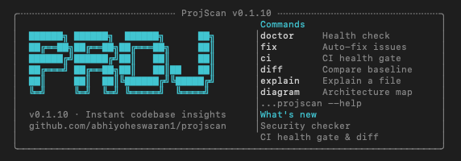

<div align="center">

# projscan

[](https://www.npmjs.com/package/projscan)
[](https://github.com/abhiyoheswaran1/projscan/blob/main/LICENSE)
[](https://nodejs.org)

**Agent-first code intelligence.** An MCP server that lets AI coding agents (Claude Code, Cursor, Windsurf) query your codebase — with a CLI for humans on the side.

[AI Agent Quick Start](#ai-agent-integration-mcp) · [CLI Quick Start](#quick-start) · [Commands](#commands) · [Full Guide](docs/GUIDE.md) · [Roadmap](docs/ROADMAP.md)



</div>

---

## Why?

AI coding agents are becoming the primary interface to code. Today, when you ask your agent *"which files implement auth?"* or *"what breaks if I bump React from 18 to 19?"* — it either guesses from names, or it shells out to grep and reads raw output not built for it.

**projscan is the first code-intelligence tool built for agents, not for humans.** Your agent gets a fast, AST-accurate, context-budget-aware view of your codebase through 13 structured MCP tools. It can query the import graph, find symbol definitions, preview upgrades, rank hotspots — without loading the file tree into its context.

Humans get the same thing through the CLI.

**Everything is offline-first. Zero network calls. No API keys.**

```bash
npx projscan
```


Run `projscan doctor` for a focused health check:

```bash
npx projscan doctor
```


## Install

```bash
npm install -g projscan
```

Or run directly without installing:

```bash
npx projscan
```

## Quick Start

Run inside any repository:

```bash
projscan                            # Full project analysis
projscan doctor                     # Health check
projscan hotspots                   # Rank files by risk (churn × complexity × issues × ownership)
projscan file <path>                # Drill into a file — purpose, risk, ownership, issues
projscan fix                        # Auto-fix detected issues
projscan ci                         # CI health gate (exits 1 on low score)
projscan ci --changed-only          # Gate only on this PR's diff
projscan ci --format sarif          # SARIF 2.1.0 for GitHub Code Scanning
projscan outdated                   # Declared-vs-installed drift (offline)
projscan audit                      # npm audit, normalized + SARIF-ready
projscan upgrade <pkg>              # Preview upgrade impact (local CHANGELOG + importers)
projscan coverage                   # Coverage × hotspots — scariest untested files
projscan diff                       # Compare health + hotspot trends against a baseline
projscan diagram                    # Architecture visualization
projscan structure                  # Directory tree
projscan mcp                        # Run as an MCP server for AI coding agents
```


For a comprehensive walkthrough, see the **[Full Guide](docs/GUIDE.md)**.

## Commands

| Command | Description |
|---------|-------------|
| `projscan analyze` | Full analysis — languages, frameworks, dependencies, issues |
| `projscan doctor` | Health check — missing tooling, architecture smells, security risks |
| `projscan hotspots` | Rank files by risk — churn × complexity × issues × ownership |
| `projscan file <path>` | Drill into a file — purpose, risk, ownership, related issues |
| `projscan fix` | Auto-fix issues (ESLint, Prettier, Vitest, .editorconfig) |
| `projscan ci` | CI health gate — SARIF output, `--changed-only` PR-diff mode, exits 1 if score below threshold |
| `projscan diff` | Compare current health **and hotspot trends** against a baseline |
| `projscan explain <file>` | Explain a file's purpose, imports, exports, and issues |
| `projscan diagram` | ASCII architecture diagram of your project |
| `projscan structure` | Directory tree with file counts |
| `projscan dependencies` | Dependency analysis — counts, risks, recommendations |
| `projscan outdated` | Declared-vs-installed drift check (offline) |
| `projscan audit` | `npm audit`-powered vulnerability report — SARIF-ready for Code Scanning |
| `projscan upgrade <pkg>` | Preview upgrade impact — local CHANGELOG + importer list, offline |
| `projscan coverage` | **Coverage × hotspots — rank the scariest untested files** |
| `projscan badge` | Generate a health score badge for your README |
| `projscan mcp` | Run as an MCP server for AI coding agents (Claude Code, Cursor, …) |

To see all commands and options, run:

```bash
projscan --help
```

### Command Screenshots

<details>
<summary><strong>projscan structure</strong> — Directory tree with file counts</summary>


</details>

<details>
<summary><strong>projscan diagram</strong> — Architecture visualization</summary>


</details>

<details>
<summary><strong>projscan dependencies</strong> — Dependency analysis</summary>


</details>

<details>
<summary><strong>projscan explain</strong> — File explanation</summary>


</details>

<details>
<summary><strong>projscan badge</strong> — Health badge generation</summary>


</details>

### Output Formats

All commands support `--format` for different output targets:

```bash
projscan analyze --format json       # Machine-readable JSON
projscan doctor --format markdown    # Markdown for docs/PRs
projscan ci --format sarif           # SARIF 2.1.0 for GitHub Code Scanning
```

Formats: `console` (default), `json`, `markdown`, `sarif`

### Options

| Flag | Description |
|------|-------------|
| `--format <type>` | Output format: console, json, markdown, sarif |
| `--config <path>` | Path to a `.projscanrc` config file |
| `--changed-only` | Scope to files changed vs base ref (ci/analyze/doctor) |
| `--base-ref <ref>` | Git base ref for `--changed-only` (default: origin/main) |
| `--verbose` | Enable debug output |
| `--quiet` | Suppress non-essential output |
| `-V, --version` | Show version |
| `-h, --help` | Show help |

## Health Score

Every `projscan doctor` run calculates a health score (0–100) and letter grade:

| Grade | Score | Meaning |
|-------|-------|---------|
| A | 90–100 | Excellent — project follows best practices |
| B | 80–89 | Good — minor improvements possible |
| C | 70–79 | Fair — several issues to address |
| D | 60–69 | Poor — significant issues found |
| F | < 60 | Critical — major issues need attention |

Generate a badge for your README:

```bash
projscan badge
```

This outputs a [shields.io](https://shields.io) badge URL and markdown snippet you can paste into your README.

**Sample badge:** [](https://github.com/abhiyoheswaran1/projscan)

## What It Detects

**Languages**: TypeScript, JavaScript, Python, Go, Rust, Java, Ruby, C/C++, PHP, Swift, Kotlin, and 20+ more

**Frameworks**: React, Next.js, Vue, Nuxt, Svelte, Angular, Express, Fastify, NestJS, Vite, Tailwind CSS, Prisma, and more

**Issues**:
- Missing linting (ESLint) and formatting (Prettier) configuration
- Missing test framework
- Missing `.editorconfig`
- Large utility directories (architecture smell)
- Excessive, deprecated, or wildcard-versioned dependencies
- Missing lockfile
- Committed `.env` files and private keys (security)
- Hardcoded secrets — AWS keys, GitHub tokens, Slack tokens, generic passwords (security)
- Missing `.env` in `.gitignore` (security)

## Performance

- **5,000 files** analyzed in under 1.5 seconds
- **20,000 files** analyzed in under 3 seconds
- **Zero network requests** — everything runs locally
- **4 runtime dependencies** — minimal footprint

## CI/CD Integration

Use `projscan ci` to gate your pipelines:

```bash
projscan ci --min-score 70                     # Exits 1 if score < 70
projscan ci --min-score 80 --format json       # JSON output for parsing
projscan ci --changed-only                     # Gate only on this PR's diff
projscan ci --format sarif > projscan.sarif    # SARIF for Code Scanning
```


### GitHub Action (recommended)

projscan ships a first-party GitHub Action that installs, runs, and uploads SARIF to **GitHub Code Scanning** in one step:

```yaml
# .github/workflows/projscan.yml
name: ProjScan
on:
  push: { branches: [main] }
  pull_request: { branches: [main] }

permissions:
  contents: read
  security-events: write   # required for SARIF upload

jobs:
  scan:
    runs-on: ubuntu-latest
    steps:
      - uses: actions/checkout@v4
        with: { fetch-depth: 0 }  # needed for --changed-only
      - uses: actions/setup-node@v4
        with: { node-version: 20 }
      - uses: abhiyoheswaran1/projscan@v0.3.0
        with:
          min-score: '70'
          changed-only: 'true'
```

Inputs: `min-score`, `changed-only`, `base-ref`, `config`, `sarif-file`, `upload-sarif`, `working-directory`, `version`. Outputs: `score`, `grade`.

Findings appear in the **Security → Code scanning** tab, annotated on files and lines. PRs get inline annotations on changed lines.

### Plain workflow (no SARIF upload)

If you'd rather not upload SARIF, [`.github/projscan-ci.yml`](.github/projscan-ci.yml) is a drop-in workflow that runs projscan and posts a markdown health report as a PR comment.

## Configuration (`.projscanrc`)

Drop a `.projscanrc.json` at your repo root to set defaults — CLI flags always win over config. A `"projscan"` key in `package.json` and plain `.projscanrc` are also supported.

```json
{
  "minScore": 80,
  "baseRef": "origin/main",
  "ignore": ["**/fixtures/**", "**/generated/**"],
  "disableRules": ["missing-editorconfig", "large-*"],
  "severityOverrides": {
    "missing-prettier": "info"
  },
  "hotspots": {
    "limit": 20,
    "since": "6 months ago"
  }
}
```

Fields:

- `minScore` — default `ci` threshold (0–100)
- `baseRef` — default base ref for `--changed-only`
- `ignore` — extra glob patterns added to the built-in ignore list
- `disableRules` — silence rules by id; supports wildcard `prefix-*`
- `severityOverrides` — remap a rule's severity (`info` / `warning` / `error`)
- `hotspots.limit` / `hotspots.since` — defaults for the `hotspots` command

## Tracking Health Over Time

Save a baseline and compare later:

```bash
projscan diff --save-baseline       # Save current score
# ... make changes ...
projscan diff                       # Compare against baseline
projscan diff --format markdown     # Markdown diff for PRs
```


## Hotspots — Where to Fix First

A flat health score doesn't tell you what to do. **`projscan hotspots`** combines `git log` churn, file complexity, open issues, recency, and **ownership** into a single risk score per file — so you know where refactoring or review will actually pay off.

```bash
projscan hotspots                       # Top 10 hotspots
projscan hotspots --limit 20
projscan hotspots --since "6 months ago"
projscan hotspots --format json         # Machine-readable for dashboards
projscan hotspots --format markdown     # Drop into a PR or tech-debt ticket
```

Hotspot ranking follows the classic Feathers "churn × complexity" heuristic with boosts for files that fail `projscan doctor`, changed recently, or show **bus factor 1** (single-author + high churn). Falls back gracefully outside a git repo.

### Drill Into a Hotspot

```bash
projscan file src/cli/index.ts
```

Combines the file's purpose, imports, exports, hotspot risk, ownership, and every open issue that references it — the natural follow-up to `projscan hotspots`.

### Track Trends Over Time

```bash
projscan diff --save-baseline           # Snapshots health + hotspots
# ...time passes, commits happen...
projscan diff                           # Shows which hotspots rose / fell
```

The baseline file now captures top hotspots too, so `diff` surfaces files that are **getting worse** (not just new issues).

## Dependency Health

projscan ships three focused commands for keeping your dependency graph healthy — all **offline** by default, no registry calls.

```bash
projscan outdated                       # Which declared deps drift from what's installed?
projscan outdated --format json         # Machine-readable drift report
projscan audit                          # Wrap npm audit; normalized, SARIF-ready
projscan audit --format sarif > a.sarif # Upload to GitHub Code Scanning
projscan upgrade chalk                  # What breaks if I bump chalk? Who imports it?
projscan upgrade chalk --format markdown # Paste-ready review comment
```

### What each one tells you

- **`outdated`** — reads `package.json` and `node_modules/<pkg>/package.json` to classify drift (`major` / `minor` / `patch` / `same` / `unknown`). No network.
- **`audit`** — wraps `npm audit --json`, normalizes the output, and emits SARIF with per-finding rules anchored to `package.json`. Graceful fallback message for yarn/pnpm projects.
- **`upgrade <pkg>`** — reads `node_modules/<pkg>/CHANGELOG.md`, slices the section between your installed version and the previous one, flags `BREAKING CHANGE` / `deprecated` / `removed support` markers, and lists every file in your repo that imports the package. All offline.

### Unused dependencies (automatic in `doctor`)

`projscan doctor` now flags declared dependencies that are never imported from source. Each finding is anchored to the **exact line in `package.json`** so GitHub Code Scanning PR annotations land in the right place.

Implicit-use packages (typescript, eslint/prettier plugins, `@types/*`, and anything invoked from a `package.json` script) are allowlisted. Override via `.projscanrc` → `disableRules` if projscan flags something that is used but not imported.

## Coverage × Hotspots — Scariest Untested Files

`projscan coverage` joins your test coverage with the hotspot ranking. A file with high churn and low coverage is where a bug is most likely to bite you — so that's where you want tests first.

```bash
projscan coverage                       # Top 30 scariest untested files
projscan coverage --format markdown     # Paste into a tech-debt ticket
projscan coverage --format json         # Machine-readable for dashboards
```

**How it decides "scariest":** `priority = riskScore × (0.3 + 0.7 × uncoveredFraction)` — so a file with 50 risk and 10% coverage outranks a file with 50 risk and 95% coverage.

**Which coverage files are supported:**

- `coverage/lcov.info` (lcov — Vitest, Jest, c8)
- `coverage/coverage-final.json` (Istanbul per-file detail)
- `coverage/coverage-summary.json` (Istanbul summary)

Coverage is also automatically joined into `projscan hotspots` when one of those files exists — no flag needed. Uncovered churning files get a score bump and a `low coverage (X%)` reason tag.

### Dead-code detection (automatic in `doctor`)

`projscan doctor` now flags source files whose exports nothing imports — dead code left over from refactors or utilities that were never wired up. Respects `package.json` public entry points (`main`, `exports`, `bin`, `types`), skips test files and barrel (`index`) files.

## AI Agent Integration (MCP)

**This is the primary way to use projscan.** `projscan mcp` starts an [MCP](https://modelcontextprotocol.io) server over stdio so AI coding agents can query your codebase with real structural accuracy — not regex, not grep.

### Claude Code

```bash
claude mcp add projscan -- npx projscan mcp
```

### Cursor / Windsurf / any MCP client

```json
{
  "mcpServers": {
    "projscan": {
      "command": "npx",
      "args": ["projscan", "mcp"]
    }
  }
}
```

### What agents can ask

- *"Who imports `src/auth/jwt.ts`?"* → `projscan_graph { file, direction: "importers" }`
- *"Where is `runAudit` defined?"* → `projscan_search { query: "runAudit", scope: "symbols" }`
- *"Which files implement auth?"* → `projscan_search { query: "auth", scope: "content" }`
- *"What are the scariest untested files?"* → `projscan_coverage`
- *"What breaks if I bump chalk to 6?"* → `projscan_upgrade { package: "chalk" }`
- *"Where should I refactor first?"* → `projscan_hotspots`

### The 13 MCP tools

**Structural (0.6.0 — new, agent-native):**
- **`projscan_graph`** — query the AST-based code graph. Directions: `imports`, `exports`, `importers`, `symbol_defs`, `package_importers`. Millisecond responses on a warm cache.
- **`projscan_search`** — fast search across `symbols` (exported names), `files` (path substring), or `content` (source substring with line + excerpt). Replaces the temptation to shell out to grep.

**Analysis:**
- `projscan_analyze` — full project report
- `projscan_doctor` — health score + issues
- `projscan_hotspots` — risk-ranked files (churn × complexity × issues × ownership × coverage)
- `projscan_file` — per-file risk + ownership + related issues
- `projscan_explain` — per-file purpose, imports, exports, smells
- `projscan_structure` — directory tree
- `projscan_coverage` — scariest untested files (coverage × hotspots)

**Dependencies:**
- `projscan_dependencies` — declared deps, risks
- `projscan_outdated` — declared-vs-installed drift (offline)
- `projscan_audit` — normalized `npm audit`
- `projscan_upgrade` — upgrade preview (CHANGELOG + importers, offline)

### Context-window budgeting

**Every MCP tool accepts an optional `max_tokens` argument.** Set it and projscan serializes the result, and — if over budget — truncates the largest array field record-by-record until it fits. Responses include a `_budget` sidecar when truncated so your agent knows it got a partial view.

```json
{ "name": "projscan_hotspots", "arguments": { "limit": 100, "max_tokens": 800 } }
```

### Incremental index cache

projscan caches parsed ASTs at `.projscan-cache/graph.json` (auto-gitignored). First run populates it; subsequent runs re-parse only files whose `mtime` changed. Agent queries on a warm cache are milliseconds, not seconds.

### Prompts (2, parameterized with live project data)
- `prioritize_refactoring` — ranked plan grounded in current hotspots
- `investigate_file` — senior-engineer brief for a specific file

### Resources (3, readable on demand)
- `projscan://health` · `projscan://hotspots` · `projscan://structure`

## Use Cases

- **Onboarding**: Understand any codebase in seconds, not hours
- **Code reviews**: Run `projscan doctor --format markdown` and paste into PRs
- **Tech-debt prioritization**: Use `projscan hotspots` to decide what deserves refactoring time
- **AI-assisted development**: Mount `projscan mcp` in your agent of choice for grounded edits
- **CI/CD**: Use `projscan ci` to enforce health standards in your pipeline
- **Security**: Catch committed secrets and `.env` files before they reach production
- **Consulting**: Quickly assess client projects before diving in
- **Maintenance**: Track health trends with `projscan diff` across releases

## Contributing

Contributions are welcome! Please see [CONTRIBUTING.md](CONTRIBUTING.md) for guidelines.

## License

MIT
